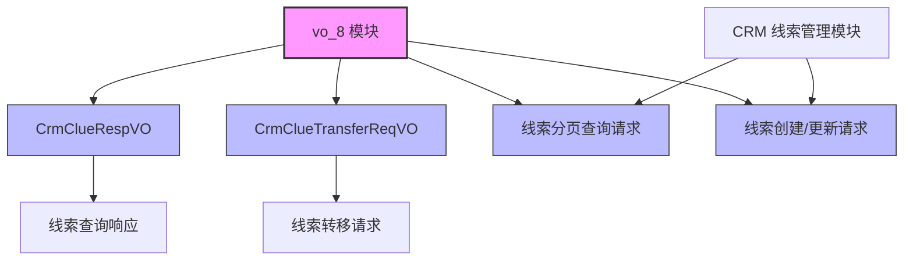
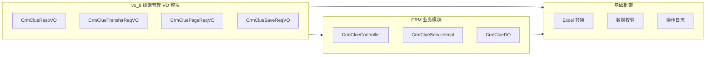
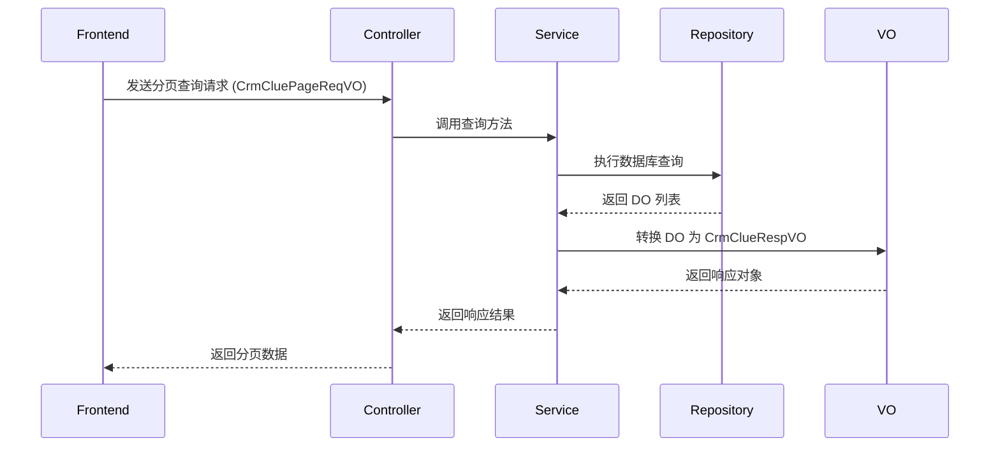
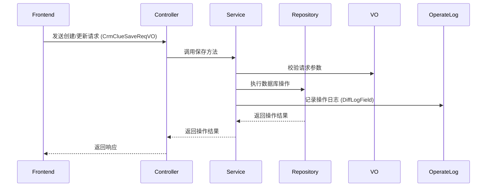
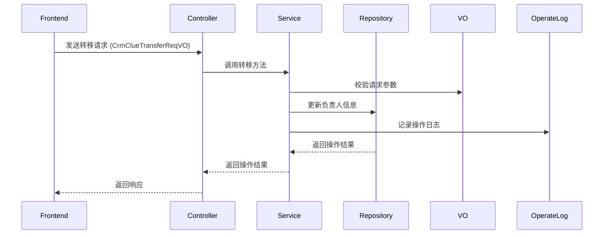

# vo_8 模块文档 - CRM 线索管理 VO

## 1. 模块概述

**vo_8** 模块是 CRM（客户关系管理）系统中的线索（Lead）管理模块的视图对象（VO）层，主要负责定义线索管理相关的请求参数和响应数据对象。该模块位于 `yudao-module-crm/src/main/java/cn/iocoder/yudao/module/crm/controller/admin/clue/vo/` 路径下，为前端页面和后端控制器提供标准化的数据传输对象。

线索管理是 CRM 系统的核心功能之一，用于跟踪潜在客户（线索）的跟进情况、转化状态等信息。vo_8 模块通过一系列 VO 类实现了数据封装、格式转换和校验功能，确保前后端数据交互的一致性和安全性。

## 2. 架构概览

### 模块关系图

## 3. 核心组件说明

### 3.1 CrmClueRespVO - 线索响应对象

**文件路径**: `yudao-module-crm/src/main/java/cn/iocoder/yudao/module/crm/controller/admin/clue/vo/CrmClueRespVO.java`

**描述**: 用于前端展示线索信息的响应对象，包含线索的所有详细信息，支持 Excel 导出功能。

**核心字段**:

| 字段名 | 类型 | 描述 | 备注 |
|--------|------|------|------|
| id | Long | 线索主键 | 自增 |
| name | String | 线索名称 | 必填 |
| followUpStatus | Boolean | 跟进状态 | 使用 DictConvert 转换，支持 Excel 导出 |
| contactLastTime | LocalDateTime | 最后跟进时间 | |
| contactLastContent | String | 最后跟进内容 | |
| contactNextTime | LocalDateTime | 下次联系时间 | |
| ownerUserId | Long | 负责人编号 | |
| ownerUserName | String | 负责人名字 | |
| ownerUserDeptName | String | 负责人部门 | |
| transformStatus | Boolean | 转化状态 | 使用 DictConvert 转换 |
| customerId | Long | 客户编号 | 关联客户 |
| customerName | String | 客户名称 | |
| mobile | String | 手机号 | |
| telephone | String | 电话 | |
| qq | String | QQ | |
| wechat | String | 微信 | |
| email | String | 邮箱 | |
| areaId | Integer | 地区编号 | |
| areaName | String | 地区名称 | |
| detailAddress | String | 详细地址 | |
| industryId | Integer | 所属行业 | 使用 DictFormat 转换 |
| level | Integer | 客户等级 | 使用 DictFormat 转换 |
| source | Integer | 客户来源 | 使用 DictFormat 转换 |
| remark | String | 备注 | |
| creator | String | 创建人 | |
| creatorName | String | 创建人名字 | |
| createTime | LocalDateTime | 创建时间 | |
| updateTime | LocalDateTime | 更新时间 | |

**特性**:
- 使用 `@DictFormat` 和 `@DictConvert` 实现字典值到文本的转换，支持 Excel 导出时显示可读文本
- 包含 `@ExcelProperty` 注解，定义 Excel 导出时的列名和转换器
- 继承自 Lombok 的 `@Data` 和 `@ToString`，自动生成 getter/setter 和 toString 方法

### 3.2 CrmClueTransferReqVO - 线索转移请求对象

**文件路径**: `yudao-module-crm/src/main/java/cn/iocoder/yudao/module/crm/controller/admin/clue/vo/CrmClueTransferReqVO.java`

**描述**: 用于线索负责人转移的请求对象，包含线索 ID 和新负责人信息。

**核心字段**:

| 字段名 | 类型 | 描述 | 备注 |
|--------|------|------|------|
| id | Long | 线索编号 | 必填，不能为空 |
| newOwnerUserId | Long | 新负责人的用户编号 | 必填，不能为空 |
| oldOwnerPermissionLevel | Integer | 老负责人加入团队后的权限级别 | 可选，null 表示移除 |

**特性**:
- 使用 `@InEnum` 注解对权限级别进行枚举校验，确保传入的值在允许的范围内
- 使用 `@NotNull` 校验必填字段，保证数据完整性
- 遵循 Vo 对象的标准命名规范，以 ReqVO 结尾表示请求对象

### 3.3 CrmCluePageReqVO - 线索分页查询请求对象

**文件路径**: `yudao-module-crm/src/main/java/cn/iocoder/yudao/module/crm/controller/admin/clue/vo/CrmCluePageReqVO.java`

**描述**: 用于线索列表分页查询的请求对象，继承自 `PageParam`，包含分页参数和查询条件。

**核心字段**:

| 字段名 | 类型 | 描述 | 备注 |
|--------|------|------|------|
| name | String | 线索名称 | 模糊查询 |
| transformStatus | Boolean | 转化状态 | |
| telephone | String | 电话 | 模糊查询 |
| mobile | String | 手机号 | 模糊查询 |
| sceneType | Integer | 场景类型 | 使用 InEnum 校验，null 表示全部 |
| industryId | Integer | 所属行业 | |
| level | Integer | 客户等级 | |
| source | Integer | 客户来源 | |
| followUpStatus | Boolean | 跟进状态 | |
| createTime | LocalDateTime[] | 创建时间 | 时间范围查询 |

**特性**:
- 继承 `PageParam`，自动包含当前页、页大小等分页参数
- 使用 `@InEnum` 校验场景类型，确保传入值合法
- 时间范围查询使用 LocalDateTime 数组，配合 `@DateTimeFormat` 解析时间字符串
- 所有字段均为可选，支持灵活组合查询条件

### 3.4 CrmClueSaveReqVO - 线索创建/更新请求对象

**文件路径**: `yudao-module-crm/src/main/java/cn/iocoder/yudao/module/crm/controller/admin/clue/vo/CrmClueSaveReqVO.java`

**描述**: 用于线索创建和更新的请求对象，包含线索的所有可编辑字段，支持数据校验和操作日志记录。

**核心字段**:

| 字段名 | 类型 | 描述 | 备注 |
|--------|------|------|------|
| id | Long | 编号 | 更新时必填 |
| name | String | 线索名称 | 必填，@DiffLogField 记录变更 |
| contactLastTime | LocalDateTime | 最后跟进时间 | 日期格式化 |
| contactNextTime | LocalDateTime | 下次联系时间 | 日期格式化 |
| ownerUserId | Long | 负责人编号 | 必填 |
| mobile | String | 手机号 | 手机号格式校验，@DiffLogField |
| telephone | String | 电话 | 电话格式校验，@DiffLogField |
| qq | String | QQ | 长度校验，@DiffLogField |
| wechat | String | 微信 | 长度校验，@DiffLogField |
| email | String | 邮箱 | 邮箱格式校验，@DiffLogField |
| areaId | Integer | 地区编号 | 使用 SysAreaParseFunction 解析 |
| detailAddress | String | 详细地址 | @DiffLogField |
| industryId | Integer | 所属行业 | 字典格式转换，@DiffLogField |
| level | Integer | 客户等级 | 枚举校验，@DiffLogField |
| source | Integer | 客户来源 | 使用 CrmCustomerSourceParseFunction 解析 |
| description | String | 客户描述 | 长度校验，@DiffLogField |
| remark | String | 备注 | @DiffLogField |

**特性**:
- 使用 `@Mobile`、`@Telephone`、`@Email` 等自定义校验注解进行格式验证
- 使用 `@InEnum` 校验客户等级枚举值
- 使用 `@DiffLogField` 注解记录操作日志中的字段变更，配合 ParseFunction 实现字段值解析
- 使用 `@DictFormat` 注解实现 Excel 导出时的字典值转换
- 日期字段使用 `@DateTimeFormat` 指定日期格式

## 4. 模块功能流程

### 4.1 线索查询流程

### 4.2 线索创建/更新流程

### 4.3 线索转移流程

## 5. 与其他模块的集成

### 5.1 与 Excel 导出模块集成

vo_8 模块中的 VO 类与 `yudao-module-excel` 模块集成，支持 Excel 导出功能：

- `CrmClueRespVO` 使用 `@ExcelProperty` 和 `@DictFormat` 注解，实现 Excel 导出时的列名设置和字典值转换
- 通过 `DictConvert` 转换器将数据库中的字典值（如整数）转换为可读文本（如"是"/"否"）

### 5.2 与操作日志模块集成

vo_8 模块中的 `CrmClueSaveReqVO` 与操作日志框架集成：

- 使用 `@DiffLogField` 注解标记需要记录变更的字段
- 配合 `CrmCustomerIndustryParseFunction`、`CrmCustomerLevelParseFunction`、`CrmCustomerSourceParseFunction` 等 ParseFunction，实现字段值的解析和日志记录
- 在 `yudao-module-crm/src/main/java/cn/iocoder/yudao/module/crm/framework/operatelog/core/` 目录下定义了这些解析函数

### 5.3 与权限校验模块集成

vo_8 模块中的请求对象与权限校验系统集成：

- `CrmClueTransferReqVO` 使用 `@InEnum` 校验权限级别，确保用户有权限执行转移操作
- 权限校验逻辑在 `CrmPermissionAspect` 和 `CrmPermissionUtils` 中实现

## 6. 设计模式分析

vo_8 模块采用了多种设计模式：

### 6.1 VO (View Object) 模式

- 所有类都是 VO 对象，用于前端展示和请求参数传递
- 与 DO (Data Object) 分离，实现数据层的解耦
- 与 DTO (Data Transfer Object) 配合使用，实现不同层次的数据传输

### 6.2 策略模式 (Strategy Pattern)

- 在 `CrmClueSaveReqVO` 中使用不同的 ParseFunction 解析不同字段的值
- 每个 ParseFunction 对应一种数据类型的解析策略

### 6.3 模板方法模式 (Template Method Pattern)

- `CrmCluePageReqVO` 继承 `PageParam`，复用分页查询的模板逻辑
- 子类只需添加特定的查询条件，无需重复分页代码

## 7. API 说明

### 7.1 CrmClueRespVO

**用途**: 线索查询响应

**字段说明**:
- 包含线索的所有详细信息，支持 Excel 导出
- 使用字典转换将存储的编码值转换为可读文本

### 7.2 CrmClueTransferReqVO

**用途**: 线索转移请求

**字段说明**:
- `id`: 线索 ID
- `newOwnerUserId`: 新负责人用户 ID
- `oldOwnerPermissionLevel`: 老负责人权限级别（可选）

### 7.3 CrmCluePageReqVO

**用途**: 线索分页查询请求

**字段说明**:
- 继承分页参数，支持多条件组合查询
- `sceneType`: 场景类型枚举
- `createTime`: 时间范围查询

### 7.4 CrmClueSaveReqVO

**用途**: 线索创建/更新请求

**字段说明**:
- 包含所有可编辑字段
- 支持数据校验和日志记录
- 使用字典转换和枚举校验

## 8. 最佳实践建议

1. **字段命名规范**: 所有 VO 类名以 `RespVO`（响应）或 `ReqVO`（请求）结尾，清晰区分用途
2. **注解使用**: 充分使用 Lombok 注解减少样板代码，使用校验注解保证数据有效性
3. **字典转换**: 对于枚举型字段，使用 `@DictFormat` 和 `@DictConvert` 实现前后端数据的一致性
4. **日志记录**: 对于变更字段，使用 `@DiffLogField` 记录操作日志，便于审计和追踪
5. **分页查询**: 分页查询对象继承 `PageParam`，复用分页逻辑

## 9. 相关模块参考

- [yudao-module-crm](yudao-module-crm.md) - CRM 业务模块
- [yudao-module-excel](yudao-module-excel.md) - Excel 导出模块
- [yudao-module-operatelog](yudao-module-operatelog.md) - 操作日志模块
- [yudao-framework-common](yudao-framework-common.md) - 基础框架通用模块
