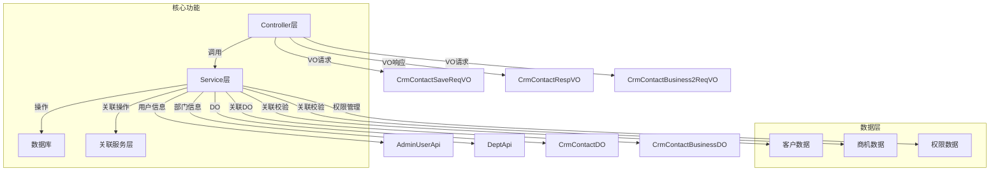

# CRM 联系人管理模块 (vo_9)

## 1. 模块概述

CRM 联系人管理模块是 Yudao 企业级 CRM 系统的核心功能之一，用于管理客户联系人信息。该模块提供了联系人的增删改查、联系人转移、联系人关联商机等完整功能，支持数据权限控制、操作日志记录、关联关系校验等特性。

## 2. 架构概览



## 3. 核心功能模块

### 3.1 联系人基础管理

**功能描述**：提供联系人的完整 CRUD 操作，包括创建、更新、删除、查询、分页、导出等功能。

**核心组件**：
- `CrmContactController`：RESTful API 接口层，处理 HTTP 请求
- `CrmContactServiceImpl`：业务逻辑实现层，包含联系人核心操作
- `CrmContactMapper`：数据访问层，与数据库交互

**API 接口**：
| 接口路径 | 方法 | 描述 | 权限 |
|---------|------|------|------|
| `/crm/contact/create` | POST | 创建联系人 | `crm:contact:create` |
| `/crm/contact/update` | PUT | 更新联系人 | `crm:contact:update` |
| `/crm/contact/delete` | DELETE | 删除联系人 | `crm:contact:delete` |
| `/crm/contact/get` | GET | 获取联系人详情 | `crm:contact:query` |
| `/crm/contact/list` | GET | 获取联系人列表 | `crm:contact:query` |
| `/crm/contact/page` | GET | 分页获取联系人 | `crm:contact:query` |
| `/crm/contact/export-excel` | GET | 导出联系人 Excel | `crm:contact:export` |
| `/crm/contact/transfer` | PUT | 联系人转移 | `crm:contact:update` |

### 3.2 联系人关联商机

**功能描述**：实现联系人与商机之间的多对多关联关系管理，支持从联系人侧或商机侧进行关联/解关联操作。

**核心组件**：
- `CrmContactBusinessController`：关联关系 API 接口
- `CrmContactBusinessServiceImpl`：关联关系业务逻辑
- `CrmContactBusinessMapper`：关联关系数据访问

**API 接口**：
| 接口路径 | 方法 | 描述 | 权限 |
|---------|------|------|------|
| `/crm/contact/create-business-list` | POST | 创建联系人-商机关联（联系人侧） | `crm:contact:create-business` |
| `/crm/contact/create-business-list2` | POST | 创建联系人-商机关联（商机侧） | `crm:contact:create-business` |
| `/crm/contact/delete-business-list` | DELETE | 删除联系人-商机关联（联系人侧） | `crm:contact:delete-business` |
| `/crm/contact/delete-business-list2` | DELETE | 删除联系人-商机关联（商机侧） | `crm:contact:delete-business` |

### 3.3 联系人转移

**功能描述**：支持联系人负责人的转移，将联系人从一个负责人转移到另一个负责人，同时更新数据权限。

**核心逻辑**：
1. 校验联系人是否存在
2. 执行数据权限转移（`permissionService.transferPermission`）
3. 更新联系人负责人字段
4. 记录操作日志

### 3.4 联系人跟进更新

**功能描述**：更新联系人的下次联系时间和跟进内容，用于客户跟进管理。

**核心方法**：
- `updateContactFollowUp(Long id, LocalDateTime contactNextTime, String contactLastContent)`

## 4. 数据对象说明

### 4.1 请求/响应 VO

#### CrmContactSaveReqVO（联系人创建/更新请求）

```java
@Data
@Schema(description = "管理后台 - CRM 联系人创建/更新 Request VO")
public class CrmContactSaveReqVO {
    
    private Long id;  // 主键
    
    @NotNull(message = "姓名不能为空")
    private String name;  // 姓名
    
    @NotNull(message = "客户编号不能为空")
    private Long customerId;  // 客户编号
    
    @DateTimeFormat(pattern = FORMAT_YEAR_MONTH_DAY)
    private LocalDateTime contactNextTime;  // 下次联系时间
    
    @NotNull(message = "负责人不能为空")
    private Long ownerUserId;  // 负责人用户编号
    
    @Mobile
    private String mobile;  // 手机号
    
    @Telephone
    private String telephone;  // 电话
    
    private Long qq;  // QQ
    
    private String wechat;  // 微信
    
    @Email
    private String email;  // 电子邮箱
    
    private Integer areaId;  // 地区编号
    
    private String detailAddress;  // 地址
    
    private Integer sex;  // 性别
    
    private Boolean master;  // 是否关键决策人
    
    private String post;  // 职位
    
    private Long parentId;  // 直属上级
    
    private String remark;  // 备注
    
    private Long businessId;  // 关联商机 ID（用于商机页面新建联系人时自动关联）
}
```

#### CrmContactBusiness2ReqVO（商机关联联系人请求）

```java
@Data
@Schema(description = "管理后台 - CRM 联系人商机 Request VO") // 【商机关联联系人】用于关联，取消关联的操作
public class CrmContactBusiness2ReqVO {
    
    @NotNull(message="商机不能为空")
    private Long businessId;  // 商机编号
    
    @NotEmpty(message="联系人数组不能为空")
    private List<Long> contactIds;  // 联系人编号数组
}
```

#### CrmContactRespVO（联系人响应 VO）

包含联系人详细信息，包括客户名称、创建人名称、负责人名称、直属上级名称等关联信息。

### 4.2 数据库 DO

#### CrmContactDO（联系人实体）

| 字段名 | 类型 | 描述 |
|--------|------|------|
| id | BIGINT | 主键 |
| name | VARCHAR | 姓名 |
| customer_id | BIGINT | 客户编号 |
| contact_next_time | DATETIME | 下次联系时间 |
| owner_user_id | BIGINT | 负责人用户编号 |
| mobile | VARCHAR | 手机号 |
| telephone | VARCHAR | 电话 |
| qq | BIGINT | QQ |
| wechat | VARCHAR | 微信 |
| email | VARCHAR | 电子邮箱 |
| area_id | INTEGER | 地区编号 |
| detail_address | VARCHAR | 地址 |
| sex | INTEGER | 性别 |
| master | BOOLEAN | 是否关键决策人 |
| post | VARCHAR | 职位 |
| parent_id | BIGINT | 直属上级 |
| remark | VARCHAR | 备注 |
| creator | BIGINT | 创建人 |
| create_time | DATETIME | 创建时间 |
| updater | BIGINT | 更新人 |
| update_time | DATETIME | 更新时间 |

#### CrmContactBusinessDO（联系人-商机关联实体）

| 字段名 | 类型 | 描述 |
|--------|------|------|
| id | BIGINT | 主键 |
| contact_id | BIGINT | 联系人编号 |
| business_id | BIGINT | 商机编号 |

## 5. 权限控制

联系人模块采用基于 `@CrmPermission` 注解的权限控制机制：

| 操作 | 权限级别 | 校验逻辑 |
|------|---------|---------|
| 创建联系人 | OWNER | 创建者自动拥有权限 |
| 更新联系人 | WRITE | 需要写权限 |
| 删除联系人 | OWNER | 需要所有者权限 |
| 查询联系人 | READ | 需要读权限 |
| 转移联系人 | OWNER | 需要所有者权限 |
| 关联商机 | WRITE | 需要联系人写权限或商机写权限 |

## 6. 操作日志

系统自动记录联系人相关的操作日志，包括：
- 联系人创建（CRM_CONTACT_CREATE_SUB_TYPE）
- 联系人更新（CRM_CONTACT_UPDATE_SUB_TYPE）
- 联系人删除（CRM_CONTACT_DELETE_SUB_TYPE）
- 联系人转移（CRM_CONTACT_TRANSFER_SUB_TYPE）
- 联系人跟进（CRM_CONTACT_FOLLOW_UP_SUB_TYPE）
- 负责人变更（CRM_CONTACT_UPDATE_OWNER_USER_SUB_TYPE）

日志通过 `@LogRecord` 注解自动记录，包含业务类型、子类型、业务编号、成功状态等信息。

## 7. 数据校验

联系人模块包含以下数据校验逻辑：

1. **关联数据存在性校验**：
   - 校验客户是否存在
   - 校验负责人是否存在
   - 校验直属上级是否存在
   - 校验商机是否存在（如有关联）

2. **删除前校验**：
   - 检查联系人是否关联合同，如有则禁止删除

3. **字段校验**：
   - 手机号格式校验（@Mobile）
   - 电话格式校验（@Telephone）
   - 邮箱格式校验（@Email）
   - 必填字段校验（@NotNull, @NotEmpty）

## 8. 与其他模块的集成

### 8.1 与 CRM 客户模块集成

- 联系人必须关联客户（`customerId` 字段）
- 通过 `CrmCustomerService` 校验客户存在性
- 在联系人详情中展示客户名称

### 8.2 与 CRM 商机模块集成

- 通过 `CrmContactBusinessDO` 表实现多对多关联
- 支持从联系人侧或商机侧进行关联操作
- 通过 `CrmBusinessService` 校验商机存在性

### 8.3 与系统权限模块集成

- 使用 `AdminUserApi` 获取用户信息
- 使用 `DeptApi` 获取部门信息
- 使用 `CrmPermissionService` 管理数据权限
- 支持联系人负责人转移时的权限转移

### 8.4 与系统日志模块集成

- 使用 `LogRecordContext` 记录操作日志上下文
- 使用 `@DiffLogField` 注解记录字段变更差异

## 9. 使用场景示例

### 场景 1：创建联系人并关联商机

```java
// 创建联系人请求
CrmContactSaveReqVO createReqVO = new CrmContactSaveReqVO();
createReqVO.setName("张三");
createReqVO.setCustomerId(100L);
createReqVO.setOwnerUserId(1000L);
createReqVO.setMobile("13800138000");
createReqVO.setBusinessId(200L);  // 关联商机

// 调用服务
Long contactId = contactService.createContact(createReqVO, currentUserId);
// 自动创建联系人-商机关联
```

### 场景 2：商机关联多个联系人

```java
// 商机关联联系人请求
CrmContactBusiness2ReqVO business2ReqVO = new CrmContactBusiness2ReqVO();
business2ReqVO.setBusinessId(200L);
business2ReqVO.setContactIds(Arrays.asList(1L, 2L, 3L));

// 调用服务
contactBusinessLinkService.createContactBusinessList2(business2ReqVO);
```

### 场景 3：联系人转移

```java
// 联系人转移请求
CrmContactTransferReqVO transferReqVO = new CrmContactTransferReqVO();
transferReqVO.setId(1L);
transferReqVO.setNewOwnerUserId(1001L);
transferReqVO.setOldOwnerPermissionLevel(PermissionLevelEnum.OWNER);

// 调用服务
contactService.transferContact(transferReqVO, currentUserId);
```

## 10. 注意事项

1. **删除限制**：联系人如果被合同关联，则不允许删除
2. **权限继承**：创建联系人时自动创建数据权限，权限级别为 OWNER
3. **关联校验**：所有关联的客户、负责人、商机、上级联系人必须存在
4. **数据一致性**：联系人转移时，需要同时更新数据权限和负责人字段
5. **性能优化**：列表查询时使用批量查询减少数据库访问次数
