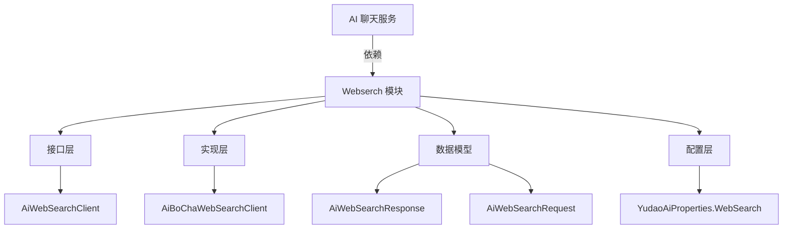
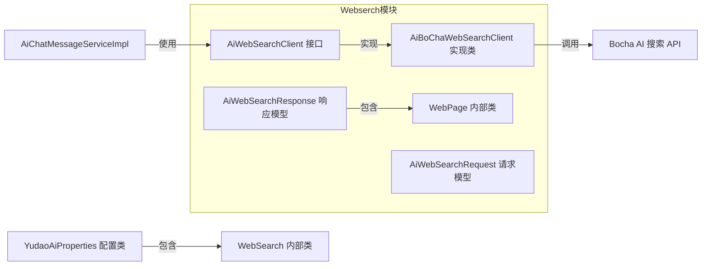
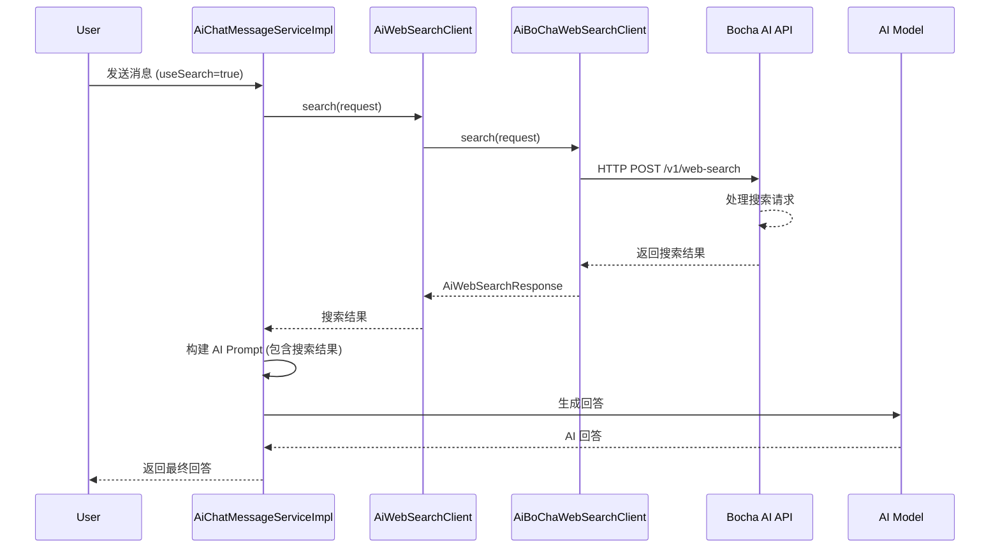

# Webserch 模块文档

## 概述

Webserch 模块是 Yudao AI 框架中的网络搜索组件，为 AI 聊天功能提供联网搜索能力。该模块允许 AI 模型在生成回答时获取实时网络信息，提高回答的准确性和时效性。

该模块采用插件化设计，目前实现了基于 Bocha AI 搜索 API 的客户端，通过统一的 `AiWebSearchClient` 接口，便于未来扩展其他搜索引擎实现。

## 核心功能

1. **网络搜索请求处理**：接收搜索查询参数并转换为特定搜索引擎的请求格式
2. **搜索结果解析**：将搜索引擎返回的原始数据转换为统一的 `AiWebSearchResponse` 格式
3. **结果过滤与格式化**：根据请求参数控制返回结果的数量和内容详细程度
4. **异常处理**：统一处理搜索服务调用过程中的网络和业务异常

## 架构设计

### 模块结构



### 组件关系



## 详细设计

### 数据模型

#### AiWebSearchResponse

网络搜索响应模型，封装搜索结果数据。

```java
@Data
public class AiWebSearchResponse {
    /**
     * 总数（总共匹配的网页数）
     */
    private Long total;
    
    /**
     * 数据列表
     */
    private List<WebPage> lists;
    
    /**
     * 网页对象
     */
    @Data
    public static class WebPage {
        /**
         * 名称
         *
         * 例如说：搜狐网
         */
        private String name;
        
        /**
         * 图标
         */
        private String icon;
        
        /**
         * 标题
         *
         * 例如说：186页|阿里巴巴：2024年环境、社会和治理（ESG）报告
         */
        private String title;
        
        /**
         * URL
         *
         * 例如说：https://m.sohu.com/a/815036254_121819701/?pvid=000115_3w_a
         */
        @SuppressWarnings("JavadocLinkAsPlainText")
        private String url;
        
        /**
         * 内容的简短描述
         */
        private String snippet;
        
        /**
         * 内容的文本摘要
         */
        private String summary;
    }
}
```

#### AiWebSearchRequest

网络搜索请求模型，用于封装搜索参数。

```java
@Data
public class AiWebSearchRequest {
    /**
     * 用户的搜索词
     */
    @NotEmpty(message = "搜索词不能为空")
    private String query;
    
    /**
     * 是否显示文本摘要
     *
     * true - 显示
     * false - 不显示（默认）
     */
    private Boolean summary;
    
    /**
     * 返回结果的条数
     */
    @NotNull(message = "返回结果条数不能为空")
    @Min(message = "返回结果条数最小为 1", value = 1)
    @Max(message = "返回结果条数最大为 50", value = 50)
    private Integer count;
}
```

### 接口定义

#### AiWebSearchClient

网络搜索客户端接口，定义了搜索服务的统一契约。

```java
/**
 * 网络搜索客户端接口
 *
 * @author 芋道源码
 */
public interface AiWebSearchClient {
    /**
     * 网页搜索
     *
     * @param request 搜索请求
     * @return 搜索结果
     */
    AiWebSearchResponse search(AiWebSearchRequest request);
}
```

### 实现类

#### AiBoChaWebSearchClient

基于 Bocha AI 搜索 API 的实现类。

```java
/**
 * 博查 {@link AiWebSearchClient} 实现类
 *
 * @see <a href="https://open.bochaai.com/overview">博查 AI 开放平台</a>
 *
 * @author 芋道源码
 */
@Slf4j
public class AiBoChaWebSearchClient implements AiWebSearchClient {
    // 常量定义
    public static final String BASE_URL = "https://api.bochaai.com";
    private static final String AUTHORIZATION_HEADER = "Authorization";
    private static final String BEARER_PREFIX = "Bearer ";
    
    // 依赖注入
    private final WebClient webClient;
    
    // 构造函数
    public AiBoChaWebSearchClient(String apiKey) {
        this.webClient = WebClient.builder()
                .baseUrl(BASE_URL)
                .defaultHeaders((headers) -> {
                    headers.setContentType(MediaType.APPLICATION_JSON);
                    headers.add(AUTHORIZATION_HEADER, BEARER_PREFIX + apiKey);
                })
                .build();
    }
    
    // 核心方法实现
    @Override
    public AiWebSearchResponse search(AiWebSearchRequest request) {
        // 转换请求参数
        WebSearchRequest webSearchRequest = new WebSearchRequest(
                request.getQuery(),
                request.getSummary(),
                request.getCount()
        );
        
        // 调用博查 API
        CommonResult<WebSearchResponse> response = this.webClient.post()
                .uri("/v1/web-search")
                .bodyValue(webSearchRequest)
                .retrieve()
                .onStatus(STATUS_PREDICATE, EXCEPTION_FUNCTION.apply(webSearchRequest))
                .bodyToMono(new ParameterizedTypeReference<CommonResult<WebSearchResponse>>() {})
                .block();
        
        // 错误处理
        if (response == null) {
            throw new IllegalStateException("[search][搜索结果为空]");
        }
        if (response.getData() == null) {
            throw new IllegalStateException(String.format("[search][搜索失败，code = %s, msg = %s]",
                    response.getCode(), response.getMsg()));
        }
        WebSearchResponse data = response.getData();
        
        // 转换结果
        AiWebSearchResponse result = new AiWebSearchResponse();
        if (data.webPages() == null || CollUtil.isEmpty(data.webPages().value())) {
            return result.setTotal(0L).setLists(List.of());
        }
        return result.setTotal(data.webPages().totalEstimatedMatches())
                .setLists(convertList(data.webPages().value(), page -> new AiWebSearchResponse.WebPage()
                        .setName(page.siteName()).setIcon(page.siteIcon())
                        .setTitle(page.name()).setUrl(page.url())
                        .setSnippet(page.snippet()).setSummary(page.summary())));
    }
    
    // 内部数据模型（对应 Bocha API 响应结构）
    // ... 省略内部记录类定义 ...
}
```

## 配置说明

Webserch 功能通过 `YudaoAiProperties` 进行配置：

```java
@Data
public static class WebSearch {
    private boolean enable;  // 是否启用网络搜索功能
    private String apiKey;   // 搜索服务 API 密钥
}
```

在 `AiAutoConfiguration` 中，当配置项 `yudao.ai.web-search.enable` 为 `true` 时，会自动注入 `AiBoChaWebSearchClient` Bean：

```java
@Bean
@ConditionalOnProperty(value = "yudao.ai.web-search.enable", havingValue = "true")
public AiWebSearchClient webSearchClient(YudaoAiProperties yudaoAiProperties) {
    return new AiBoChaWebSearchClient(yudaoAiProperties.getWebSearch().getApiKey());
}
```

## 使用示例

### 在 AI 聊天服务中的使用

在 `AiChatMessageServiceImpl` 中，Webserch 被用于增强 AI 聊天回答的准确性：

```java
// 注入 WebSearch 客户端（非强制依赖，允许功能关闭）
@SuppressWarnings("SpringJavaAutowiredFieldsWarningInspection")
@Autowired(required = false)
private AiWebSearchClient webSearchClient;

// 在发送消息时执行搜索
AiWebSearchResponse webSearchResponse = Boolean.TRUE.equals(sendReqVO.getUseSearch()) && webSearchClient != null ?
        webSearchClient.search(new AiWebSearchRequest().setQuery(sendReqVO.getContent())
                .setSummary(true).setCount(WEB_SEARCH_COUNT)) : null;

// 将搜索结果传递给 AI 模型作为上下文
AiChatMessageDO assistantMessage = createChatMessage(
        conversation.getId(), userMessage.getId(), model,
        userId, conversation.getRoleId(), MessageType.ASSISTANT, "", sendReqVO.getUseContext(),
        knowledgeSegments, null, webSearchResponse);
```

### 前端调用示例

前端可以通过以下方式触发网络搜索功能：

1. 在发送聊天消息时设置 `useSearch` 参数为 `true`
2. 系统会自动使用消息内容作为搜索查询
3. 搜索结果会被包装在 AI 的响应中，通过 `<WebSearch></WebSearch>` 标记提供给 AI 模型作为参考

## 与其他模块的关系

### 依赖关系

Webserch 模块依赖以下基础设施：
- Spring WebFlux（用于异步 HTTP 请求）
- Lombok（用于简化代码）
- Hutool 工具集合

### 被依赖关系

Webserch 模块被以下模块依赖：
- `AiChatMessageServiceImpl`：AI 聊天消息服务，用于在聊天过程中提供联网搜索能力
- 可能的其他 AI 服务：未来可扩展到其他需要实时信息的 AI 功能

## 接口说明

### AiWebSearchClient.search()

执行网络搜索操作。

**参数：**
- `request`: 搜索请求对象，包含查询词、是否显示摘要和返回结果数量

**返回值：**
- `AiWebSearchResponse`: 搜索响应对象，包含总结果数和网页列表

**异常：**
- `IllegalStateException`: 当搜索服务不可用或返回错误时抛出

### 数据流程



## 最佳实践

1. **错误容错**：在服务中使用 `webSearchClient != null` 检查来处理搜索服务未启用的情况
2. **结果限制**：通过 `count` 参数控制返回结果数量，平衡搜索质量和性能
3. **内容摘要**：根据需要设置 `summary` 参数来获取更详细的页面内容摘要
4. **安全性**：API 密钥应通过安全配置方式注入，避免硬编码
5. **缓存考虑**：对于频繁重复的搜索查询，可考虑在业务层添加缓存机制

## 扩展指南

要添加新的搜索引擎实现：

1. 创建新的实现类，实现 `AiWebSearchClient` 接口
2. 在实现类中处理特定搜索引擎的请求格式转换和响应解析
3. 根据需要更新配置类以支持新搜索引擎的特定参数
4. 在 `AiAutoConfiguration` 中添加条件注入逻辑（如果需要支持多引擎切换）

## 性能考虑

1. **超时设置**：建议为 WebClient 设置合理的超时时间
2. **并发控制**：搜索服务可能有调用频率限制，注意控制并发请求数
3. **结果处理**：仅在需要时请求详细摘要（summary=true）以减少数据传输
4. **结果数量**：根据实际需求调整返回结果数量，避免过多不必要的数据处理

## 常见问题

**Q: 如何启用/禁用网络搜索功能？**  
A: 通过配置项 `yudao.ai.web-search.enable` 控制，设置为 `true` 启用，`false` 禁用。

**Q: 搜索服务调用失败会怎样？**  
A: 服务会捕获异常并记录日志，但不会中断主流程。聊天服务会继续使用没有搜索结果的上下文生成回答。

**Q: 可以自定义搜索结果返回数量吗？**  
A: 可以，通过 `AiWebSearchRequest` 的 `count` 参数控制，范围为 1-50。

**Q: 是否支持多种搜索引擎切换？**  
A: 当前设计支持通过实现 `AiWebSearchClient` 接口添加新的搜索引擎，但需要在配置层进行相应的适配以支持动态切换。