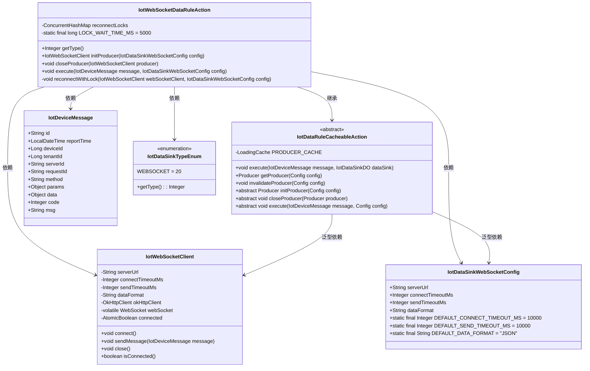

# IotWebSocketDataRuleAction

## 概述

`IotWebSocketDataRuleAction` 是物联网平台中用于将设备消息发送到外部 WebSocket 服务器的数据规则动作实现类。它继承自 `IotDataRuleCacheableAction`，利用缓存机制高效管理 WebSocket 连接，支持 ws:// 和 wss:// 协议，以及 JSON 和 TEXT 两种数据格式。

该组件是物联网规则引擎的一部分，当设备上报消息匹配特定规则时，会触发此动作将消息推送到配置的 WebSocket 端点。

## 架构与设计

### 类关系图



### 组件职责

| 组件 | 职责 |
|------|------|
| **IotWebSocketDataRuleAction** | WebSocket 数据规则动作的具体实现，负责：<br>1. 参数校验<br>2. WebSocket 客户端初始化<br>3. 连接状态检查和重连机制<br>4. 消息发送和日志记录 |
| **IotDataRuleCacheableAction** | 抽象基类，提供生产者缓存机制：<br>1. 基于 Guava Cache 的生产者实例管理<br>2. 自动过期清理（30分钟未访问）<br>3. 生命周期管理（创建、获取、关闭）<br>4. 异常处理和日志记录 |
| **IotWebSocketClient** | WebSocket 客户端封装：<br>1. 基于 OkHttp 的 WebSocket 连接管理<br>2. 连接、发送消息、关闭连接操作<br>3. 连接状态监控<br>4. 支持 JSON 和 TEXT 数据格式 |
| **IotDataSinkWebSocketConfig** | WebSocket 配置数据对象，包含：<br>1. 服务器地址<br>2. 连接超时时间<br>3. 发送超时时间<br>4. 数据格式（JSON/TEXT） |
| **IotDeviceMessage** | 物联网设备消息模型，包含设备ID、时间戳、消息方法、参数等信息 |

## 详细设计

### 核心实现细节

#### 1. 类定义和注解
```java
@Component
@Slf4j
public class IotWebSocketDataRuleAction extends
        IotDataRuleCacheableAction<IotDataSinkWebSocketConfig, IotWebSocketClient>
```
- 使用 `@Component` 注解将类注册为 Spring Bean
- 使用 Lombok 的 `@Slf4j` 注解自动生成日志对象
- 继承自泛型类 `IotDataRuleCacheableAction`，指定配置类型为 `IotDataSinkWebSocketConfig`，生产者类型为 `IotWebSocketClient`

#### 2. 常量定义
```java
private static final long LOCK_WAIT_TIME_MS = 5000;
```
- 定义重连锁的等待超时时间为 5000 毫秒（5秒）

#### 3. 成员变量
```java
private final ConcurrentHashMap<String, ReentrantLock> reconnectLocks = new ConcurrentHashMap<>();
```
- 使用 ConcurrentHashMap 存储重连锁，key 为 WebSocket 服务器地址
- 确保同一服务器地址的重连操作线程安全

#### 4. 方法实现

##### getType()
```java
@Override
public Integer getType() {
    return IotDataSinkTypeEnum.WEBSOCKET.getType();
}
```
- 返回 WebSocket 类型的枚举值（20），用于类型匹配和路由

##### initProducer()
```java
@Override
protected IotWebSocketClient initProducer(IotDataSinkWebSocketConfig config) throws Exception {
    // 1. 参数校验
    if (StrUtil.isBlank(config.getServerUrl())) {
        throw new IllegalArgumentException("WebSocket 服务器地址不能为空");
    }
    if (!StrUtil.startWithAny(config.getServerUrl(), "ws://", "wss://")) {
        throw new IllegalArgumentException("WebSocket 服务器地址必须以 ws:// 或 wss:// 开头");
    }

    // 2.1 创建 WebSocket 客户端
    IotWebSocketClient webSocketClient = new IotWebSocketClient(
            config.getServerUrl(),
            config.getConnectTimeoutMs(),
            config.getSendTimeoutMs(),
            config.getDataFormat()
    );
    // 2.2 连接服务器
    webSocketClient.connect();
    log.info("[initProducer][WebSocket 客户端创建并连接成功，服务器: {}，数据格式: {}]",
            config.getServerUrl(), config.getDataFormat());
    return webSocketClient;
}
```
- 参数校验：确保服务器地址不为空且以 ws:// 或 wss:// 开头
- 创建 IotWebSocketClient 实例并建立连接
- 记录成功连接的日志

##### closeProducer()
```java
@Override
protected void closeProducer(IotWebSocketClient producer) throws Exception {
    if (producer != null) {
        producer.close();
    }
}
```
- 安全关闭 WebSocket 客户端连接

##### execute()
```java
@Override
protected void execute(IotDeviceMessage message, IotDataSinkWebSocketConfig config) throws Exception {
    try {
        // 1.1 获取或创建 WebSocket 客户端
        IotWebSocketClient webSocketClient = getProducer(config);

        // 1.2 检查连接状态，如果断开则使用分布式锁保证重连的线程安全
        if (!webSocketClient.isConnected()) {
            reconnectWithLock(webSocketClient, config);
        }

        // 2.1 发送消息
        webSocketClient.sendMessage(message);
        // 2.2 记录发送成功日志
        log.info("[execute][message({}) config({}) 发送成功，WebSocket 服务器: {}]",
                message, config, config.getServerUrl());
    } catch (Exception e) {
        log.error("[execute][message({}) config({}) 发送失败，WebSocket 服务器: {}]",
                message, config, config.getServerUrl(), e);
        throw e;
    }
}
```
- 获取或创建 WebSocket 客户端实例
- 检查连接状态，如果断开则使用锁机制进行重连
- 发送设备消息并记录日志
- 异常处理：记录错误日志并重新抛出异常

##### reconnectWithLock()
```java
private void reconnectWithLock(IotWebSocketClient webSocketClient, IotDataSinkWebSocketConfig config) throws Exception {
    ReentrantLock lock = reconnectLocks.computeIfAbsent(config.getServerUrl(), k -> new ReentrantLock());
    boolean acquired = false;
    try {
        acquired = lock.tryLock(LOCK_WAIT_TIME_MS, TimeUnit.MILLISECONDS);
        if (!acquired) {
            throw new RuntimeException("获取 WebSocket 重连锁超时，服务器: " + config.getServerUrl());
        }
        // 双重检查：获取锁后再次检查连接状态，避免重复连接
        if (!webSocketClient.isConnected()) {
            log.warn("[reconnectWithLock][WebSocket 连接已断开，尝试重新连接，服务器: {}]", config.getServerUrl());
            webSocketClient.connect();
        }
    } catch (InterruptedException e) {
        Thread.currentThread().interrupt();
        throw new RuntimeException("获取 WebSocket 重连锁被中断，服务器: " + config.getServerUrl(), e);
    } finally {
        if (acquired && lock.isHeldByCurrentThread()) {
            lock.unlock();
        }
    }
}
```
- 使用 ConcurrentHashMap 获取或创建对应服务器地址的重连锁
- 尝试获取锁，超时时间为 5000 毫秒
- 双重检查机制：获取锁后再次检查连接状态，避免重复连接
- 如果连接断开，则尝试重新连接
- 正确处理锁的获取和释放，防止死锁

### 线程安全机制

该类通过多层机制确保线程安全：

1. **缓存层安全**：继承自 `IotDataRuleCacheableAction` 使用 Guava's LoadingCache，该缓存本身是线程安全的
2. **重连锁机制**：使用 `ConcurrentHashMap<String, ReentrantLock>` 确保同一 WebSocket 服务器地址的重连操作是线程安全的
3. **双重检查锁定**：在获取锁后再次检查连接状态，避免不必要的重连操作
4. **正确的锁释放**：在 finally 块中确保锁被正确释放，防止死锁

### 数据流程

1. 设备上报消息到物联网平台
2. 规则引擎匹配到对应的数据规则（WebSocket 类型）
3. 调用 `IotWebSocketDataRuleAction.execute()` 方法
4. 从缓存中获取或创建 WebSocket 客户端实例
5. 检查连接状态，如有需要则进行重连
6. 将设备消息序列化为 JSON 或 TEXT 格式发送到 WebSocket 服务器
7. 记录操作日志

## 配置说明

### IotDataSinkWebSocketConfig 配置项

| 配置项 | 类型 | 是否必填 | 默认值 | 说明 |
|--------|------|----------|--------|------|
| serverUrl | String | 是 | 无 | WebSocket 服务器地址，必须以 ws:// 或 wss:// 开头 |
| connectTimeoutMs | Integer | 否 | 10000 | 连接超时时间（毫秒） |
| sendTimeoutMs | Integer | 否 | 10000 | 发送超时时间（毫秒） |
| dataFormat | String | 否 | "JSON" | 数据格式，支持 "JSON" 或 "TEXT" |

### 示例配置（数据库表 iot_data_sink）
```sql
INSERT INTO iot_data_sink (id, name, type, config, status)
VALUES 
(1, 'WebSocket Sink', 20, '{"serverUrl":"ws://example.com/ws","connectTimeoutMs":5000,"sendTimeoutMs":5000,"dataFormat":"JSON"}', 1);
```

## 使用场景

1. **实时设备监控**：将设备状态更新实时推送到监控大屏
2. **设备告警通知**：当设备异常时通过 WebSocket 实时推送告警信息
3. **数据流转**：将物联网数据流转到第三方系统进行进一步处理
4. **双向通信**：虽然当前实现主要是单向发送，但 WebSocket 连接保持打开，可扩展为双通信

## 性能特点

1. **连接复用**：通过缓存机制复用 WebSocket 连接，减少频繁创建和销毁的开销
2. **自动过期**：30分钟未使用的连接自动回收，防止资源泄漏
3. **重连机制**：网络波动时自动重连，保证连接可靠性
4. **线程安全**：使用锁机制确保并发环境下的正确性
5. **日志追踪**：详细的操作日志便于问题排查和性能监控

## 异常处理

1. **参数验证异常**：在初始化阶段验证配置参数，快速失败
2. **连接异常**：连接失败时记录错误并抛出异常
3. **发送异常**：消息发送失败时记录错误并抛出异常
4. **锁获取超时**：获取重连锁超时时抛出运行时异常
5. **中断处理**：正确响应线程中断，保持中断状态

## 依赖说明

### Maven 依赖
```xml
<!-- OkHttp WebSocket 支持 -->
<dependency>
    <groupId>com.squareup.okhttp3</groupId>
    <artifactId>okhttp</artifactId>
    <version>4.9.0</version>
</dependency>

<!-- Guava Cache -->
<dependency>
    <groupId>com.google.guava</groupId>
    <artifactId>guava</artifactId>
    <version>31.0.1-jre</version>
</dependency>

<!-- Hutool 工具类 -->
<dependency>
    <groupId>cn.hutool</groupId>
    <artifactId>hutool-all</artifactId>
    <version>5.8.0</version>
</dependency>

<!-- Lombok -->
<dependency>
    <groupId>org.projectlombok</groupId>
    <artifactId>lombok</artifactId>
    <version>1.18.24</version>
    <scope>provided</scope>
</dependency>
```