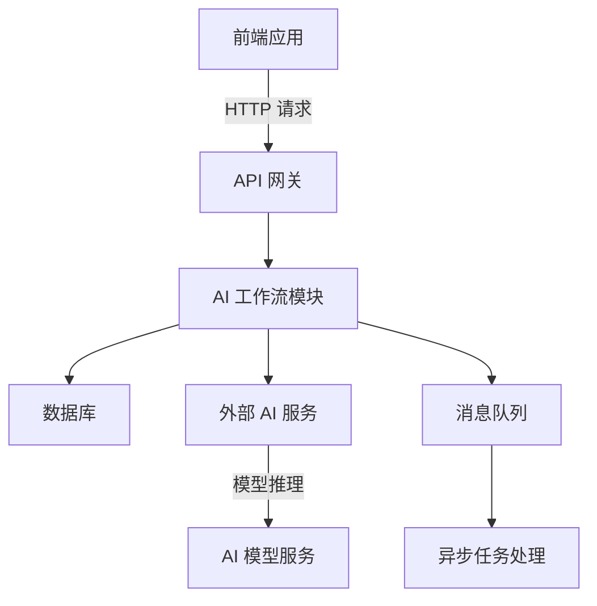
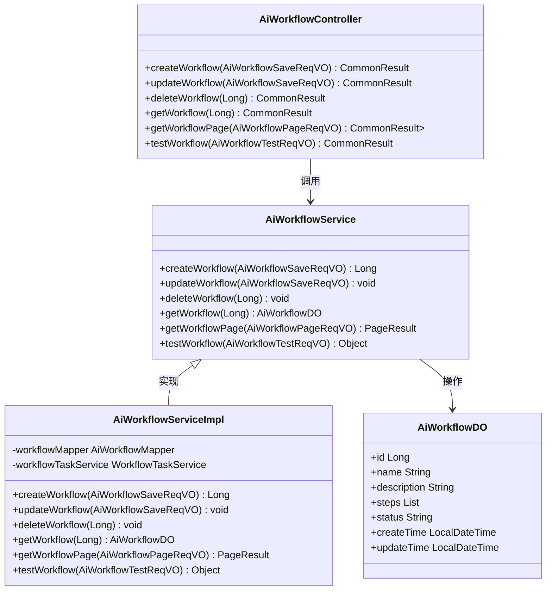
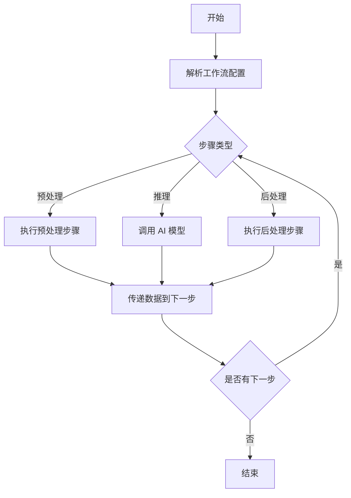
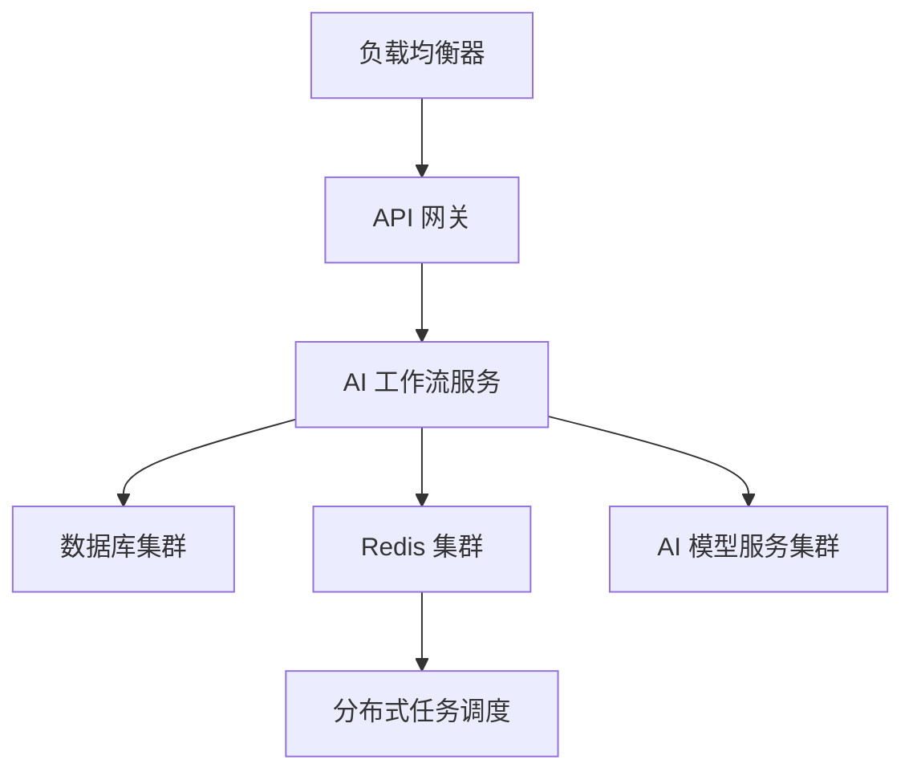

# AI 工作流模块文档

## 模块概述

AI 工作流模块是系统中用于管理和执行 AI 任务流程的核心模块。它提供了一个可配置的工作流框架，允许用户定义和执行复杂的 AI 任务流程，包括数据预处理、模型推理、后处理等多个阶段。

### 主要功能

- **工作流定义**：支持创建、更新、删除和查询 AI 工作流
- **工作流执行**：提供工作流测试和执行功能
- **流程管理**：支持工作流的分页查询和详细信息获取
- **权限控制**：集成系统权限框架，确保操作的安全性

### 核心组件

- **AiWorkflowController**：RESTful API 控制器，处理工作流的 CRUD 操作和测试
- **AiWorkflowService**：工作流服务，包含业务逻辑实现
- **AiWorkflowDO**：工作流数据对象，映射数据库表
- **AiWorkflowRespVO/AiWorkflowSaveReqVO**：响应和请求 VO 对象

## 架构设计

### 系统架构图



### 模块结构

```
ai-workflow/
├── controller/          # 控制器层
│   └── admin/
│       └── workflow/
│           ├── AiWorkflowController.java  # API 控制器
│           └── vo/                        # VO 对象
├── dal/                 # 数据访问层
│   ├── dataobject/
│   │   └── workflow/
│   │       └── AiWorkflowDO.java         # 数据对象
│   └── mapper/
│       └── workflow/
│           └── AiWorkflowMapper.java      # Mapper 接口
├── service/             # 服务层
│   ├── workflow/
│   │   ├── AiWorkflowService.java        # 服务接口
│   │   └── AiWorkflowServiceImpl.java    # 服务实现
│   └── workflow/
│       └── bo/                          # 业务对象
└── framework/           # 框架层
    └── ai/
        └── config/
            └── AiAutoConfiguration.java  # 自动配置
```

### 核心类关系图



## 业务流程

### 工作流执行流程



### 典型工作流配置示例

```json
{
  "name": "智能客服工作流",
  "description": "处理客户咨询并生成智能回复",
  "steps": [
    {
      "stepType": "preprocess",
      "model": "customer_query_parser",
      "parameters": {
        "language": "chinese",
        "intentDetection": true
      }
    },
    {
      "stepType": "inference",
      "model": "customer_service_bot",
      "parameters": {
        "max_length": 200,
        "temperature": 0.3,
        "top_p": 0.9
      }
    },
    {
      "stepType": "postprocess",
      "model": "response_formatter",
      "parameters": {}
    }
  ]
}
```

## 与其他模块的集成

### 与 AI 模块的集成

AI 工作流模块依赖于 AI 模块提供的各种 AI 服务，包括：
- 文本处理服务
- 图像处理服务
- 语音识别服务
- 自然语言理解服务

### 与消息队列的集成

工作流执行可以通过消息队列实现异步处理，提高系统的可扩展性和性能。

### 与权限系统的集成

通过 Spring Security 集成，确保工作流操作的权限控制。

## 部署与运维

### 部署架构



### 监控指标

- 工作流执行成功率
- 工作流执行平均时长
- 工作流步骤执行时长分布
- AI 模型推理延迟
- 系统资源使用情况

### 故障处理

- **工作流执行失败**：记录详细的错误日志，支持重试机制
- **AI 服务不可用**：实现熔断机制，提供降级方案
- **数据库连接异常**：配置连接池和重试策略

## 最佳实践

### 工作流设计原则

1. **模块化**：将复杂的 AI 任务拆分为多个独立的步骤
2. **可重用性**：设计通用的步骤组件，提高复用性
3. **可观测性**：为每个步骤添加详细的日志和监控
4. **容错性**：实现步骤级别的错误处理和重试机制

### 性能优化

1. **缓存**：对频繁使用的工作流配置进行缓存
2. **并行执行**：支持步骤间的并行执行
3. **异步处理**：利用消息队列实现异步执行
4. **批量处理**：支持批量执行工作流

### 安全考虑

1. **数据隔离**：确保不同租户的工作流数据隔离
2. **权限控制**：严格的权限检查和审计
3. **输入验证**：对工作流输入数据进行严格验证
4. **API 限流**：防止恶意调用和 DoS 攻击

## 扩展性设计

### 插件化架构

AI 工作流模块支持插件化扩展，可以添加新的步骤类型和 AI 模型。

### 多租户支持

支持在多租户环境下为不同租户提供独立的工作流配置和执行环境。

### 云原生适配

支持在 Kubernetes 等云原生环境下部署和扩缩容。

## 总结

AI 工作流模块为系统提供了一个灵活、可扩展的 AI 任务流程管理框架。通过模块化的设计和丰富的 API，它能够满足各种复杂的 AI 任务需求，同时与系统中的其他模块紧密集成，提供端到端的 AI 解决方案。

---

**相关模块文档**
- [AI 模块文档](ai.md)
- [系统架构文档](../architecture.md)
- [API 网关文档](../api-gateway.md)