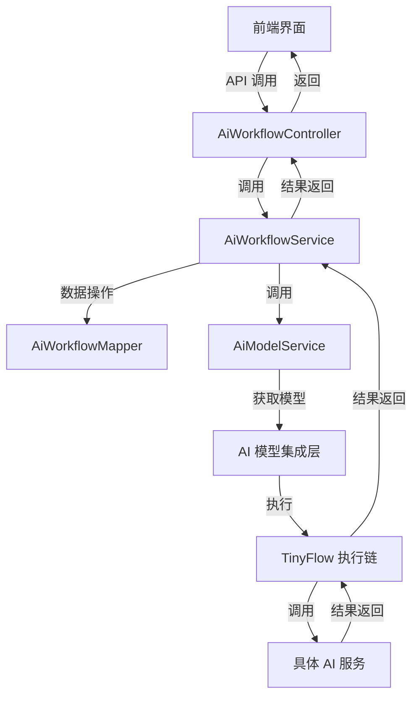

# AI 工作流模块 (workflow_2) 文档

## 模块概述

AI 工作流模块（workflow_2）是 Yudao AI 系统的核心模块之一，主要用于定义和管理 AI 任务的执行流程。该模块通过可视化的方式构建 AI 任务的执行链，支持多种 AI 模型的集成和调用，为用户提供灵活的 AI 任务自动化解决方案。

### 核心功能

1. **工作流定义与管理**：
   - 创建、更新、删除 AI 工作流
   - 工作流状态管理（启用/禁用）
   - 工作流标识和名称管理
   - 工作流模型 JSON 数据存储

2. **工作流执行与测试**：
   - 执行工作流并获取结果
   - 测试工作流执行效果
   - 支持自定义参数传递

3. **可视化工作流构建**：
   - 基于 TinyFlow 框架的工作流执行链
   - 支持多种节点类型（LLM 节点、内部节点等）
   - 与 AI 模型的深度集成

### 模块架构



## 核心组件

### 1. 数据对象 (AiWorkflowDO)

```java
@TableName(value = "ai_workflow", autoResultMap = true)
@KeySequence("ai_workflow")
@Data
public class AiWorkflowDO extends BaseDO {
    @TableId
    private Long id;
    private String name;
    private String code;
    private String graph;
    private String remark;
    private Integer status;
}
```

**字段说明：**
- `id`: 工作流编号，主键
- `name`: 工作流名称
- `code`: 工作流标识，用于唯一标识一个工作流
- `graph`: 工作流模型 JSON 数据，存储工作流的结构和配置
- `remark`: 备注信息
- `status`: 状态（启用/禁用）

### 2. 服务层 (AiWorkflowService)

```java
@Service
@Slf4j
public class AiWorkflowServiceImpl implements AiWorkflowService {
    @Resource
    private AiWorkflowMapper workflowMapper;
    @Resource
    private AiModelService apiModelService;
    
    // 创建、更新、删除、查询等核心方法
    // 测试工作流执行方法
}
```

**核心方法：**
- `createWorkflow()`: 创建新的 AI 工作流
- `updateWorkflow()`: 更新现有工作流
- `deleteWorkflow()`: 删除工作流
- `getWorkflow()`: 获取单个工作流
- `getWorkflowPage()`: 分页查询工作流
- `testWorkflow()`: 测试工作流执行

### 3. 控制器层 (AiWorkflowController)

```java
@Tag(name = "管理后台 - AI 工作流")
@RestController
@RequestMapping("/ai/workflow")
@Slf4j
public class AiWorkflowController {
    @Resource
    private AiWorkflowService workflowService;
    
    @PostMapping("/create")
    @Operation(summary = "创建 AI 工作流")
    public CommonResult<Long> createWorkflow(@Valid @RequestBody AiWorkflowSaveReqVO createReqVO) {
        return success(workflowService.createWorkflow(createReqVO));
    }
    
    // 其他 API 方法...
}
```

**API 端点：**
- `POST /ai/workflow/create`: 创建工作流
- `PUT /ai/workflow/update`: 更新工作流
- `DELETE /ai/workflow/delete`: 删除工作流
- `GET /ai/workflow/get`: 获取单个工作流
- `GET /ai/workflow/page`: 分页查询工作流
- `POST /ai/workflow/test`: 测试工作流执行

### 4. 请求/响应 VO

#### AiWorkflowSaveReqVO (保存/更新请求)
```java
@Schema(description = "管理后台 - AI 工作流新增/修改 Request VO")
@Data
public class AiWorkflowSaveReqVO {
    @Schema(description = "编号", example = "1")
    private Long id;
    
    @Schema(description = "工作流标识", requiredMode = Schema.RequiredMode.REQUIRED, example = "FLOW")
    @NotEmpty(message = "工作流标识不能为空")
    private String code;
    
    @Schema(description = "工作流名称", requiredMode = Schema.RequiredMode.REQUIRED, example = "工作流")
    @NotEmpty(message = "工作流名称不能为空")
    private String name;
    
    @Schema(description = "备注", example = "FLOW")
    private String remark;
    
    @Schema(description = "工作流模型", requiredMode = Schema.RequiredMode.REQUIRED, example = "{}")
    @NotEmpty(message = "工作流模型不能为空")
    private String graph;
    
    @Schema(description = "状态", requiredMode = Schema.RequiredMode.REQUIRED, example = "FLOW")
    @NotNull(message = "状态不能为空")
    private Integer status;
}
```

#### AiWorkflowRespVO (响应 VO)
```java
@Schema(description = "管理后台 - AI 工作流 Response VO")
@Data
public class AiWorkflowRespVO {
    @Schema(description = "编号", requiredMode = Schema.RequiredMode.REQUIRED, example = "1")
    private Long id;
    
    @Schema(description = "工作流标识", requiredMode = Schema.RequiredMode.REQUIRED, example = "FLOW")
    private String code;
    
    @Schema(description = "工作流名称", requiredMode = Schema.RequiredMode.REQUIRED, example = "工作流")
    private String name;
    
    @Schema(description = "备注", requiredMode = Schema.RequiredMode.REQUIRED, example = "工作流")
    private String remark;
    
    @Schema(description = "状态", requiredMode = Schema.RequiredMode.REQUIRED, example = "1")
    private Integer status;
    
    @Schema(description = "工作流模型 JSON", requiredMode = Schema.RequiredMode.REQUIRED, example = "{}")
    private String graph;
    
    @Schema(description = "创建时间", requiredMode = Schema.RequiredMode.REQUIRED, example = "时间戳格式")
    private LocalDateTime createTime;
}
```

#### AiWorkflowTestReqVO (测试请求)
```java
@Schema(description = "管理后台 - AI 工作流测试 Request VO")
@Data
public class AiWorkflowTestReqVO {
    @Schema(description = "工作流编号", example = "1024")
    private Long id;
    
    @Schema(description = "工作流模型", example = "{}")
    private String graph;
    
    @Schema(description = "参数", requiredMode = Schema.RequiredMode.REQUIRED, example = "{}")
    private Map<String, Object> params;
    
    @AssertTrue(message = "工作流或模型，必须传递一个")
    public boolean isGraphValid() {
        return id != null || StrUtil.isNotEmpty(graph);
    }
}
```

#### AiWorkflowPageReqVO (分页查询请求)
```java
@Schema(description = "管理后台 - AI 工作流分页 Request VO")
@Data
public class AiWorkflowPageReqVO extends PageParam {
    @Schema(description = "名称", example = "工作流")
    private String name;
    
    @Schema(description = "标识", example = "FLOW")
    private String code;
    
    @Schema(description = "状态", example = "1")
    @InEnum(CommonStatusEnum.class)
    private Integer status;
    
    @Schema(description = "创建时间")
    @DateTimeFormat(pattern = FORMAT_YEAR_MONTH_DAY_HOUR_MINUTE_SECOND)
    private LocalDateTime[] createTime;
}
```

### 5. Mapper 层 (AiWorkflowMapper)

```java
@Mapper
public interface AiWorkflowMapper extends BaseMapperX<AiWorkflowDO> {
    default AiWorkflowDO selectByCode(String code) {
        return selectOne(AiWorkflowDO::getCode, code);
    }
    
    default PageResult<AiWorkflowDO> selectPage(AiWorkflowPageReqVO pageReqVO) {
        return selectPage(pageReqVO, new LambdaQueryWrapperX<AiWorkflowDO>()
                .eqIfPresent(AiWorkflowDO::getStatus, pageReqVO.getStatus())
                .likeIfPresent(AiWorkflowDO::getName, pageReqVO.getName())
                .likeIfPresent(AiWorkflowDO::getCode, pageReqVO.getCode())
                .betweenIfPresent(AiWorkflowDO::getCreateTime, pageReqVO.getCreateTime()));
    }
}
```

## 工作流执行原理

### 1. 工作流模型 (graph)

工作流模型以 JSON 格式存储，包含节点和连接信息。典型的工作流模型结构如下：

```json
{
  "nodes": [
    {
      "id": "node1",
      "type": "llmNode",
      "data": {
        "llmId": 1,
        "prompt": "你好，请介绍一下你自己"
      }
    },
    {
      "id": "node2",
      "type": "internalNode",
      "data": {
        "action": "processResponse"
      }
    }
  ],
  "connections": [
    {
      "source": "node1",
      "target": "node2"
    }
  ]
}
```

### 2. 工作流执行流程

1. **解析工作流模型**：
   - 从数据库中获取工作流的 graph JSON 数据
   - 解析节点和连接信息

2. **构建执行链**：
   - 使用 TinyFlow 框架构建执行链
   - 根据节点类型添加不同的处理逻辑

3. **执行工作流**：
   - 传入自定义参数
   - 执行工作流中的每个节点
   - 收集执行结果

4. **返回结果**：
   - 将最终结果返回给调用者

### 3. TinyFlow 集成

TinyFlow 是一个轻量级的工作流执行框架，支持以下特性：

- **节点类型**：
  - `llmNode`: 调用大语言模型
  - `internalNode`: 内部处理节点
  - 其他自定义节点类型

- **执行链**：
  - 支持串行和并行执行
  - 支持条件分支
  - 支持循环执行

- **参数传递**：
  - 支持在节点间传递变量
  - 支持自定义参数输入

### 4. AI 模型集成

工作流模块通过 `AiModelService` 与各种 AI 模型进行集成：

```java
void getLLmProvider4Tinyflow(Tinyflow tinyflow, Long modelId) {
    // 根据模型 ID 获取对应的 ChatModel
    ChatModel chatModel = apiModelService.getChatModel(modelId);
    
    // 将模型添加到 TinyFlow 执行链
    tinyflow.addLLMProvider(chatModel);
}
```

支持的 AI 模型包括：
- 通义千问 (DashScope)
- 智谱 AI (ZhiPu)
- 百川 AI (BaiChuan)
- 星火 AI (XingHuo)
- 文心一言 (YiYan)
- 等等

## API 接口详情

### 1. 创建工作流

**请求：**
```http
POST /ai/workflow/create
Content-Type: application/json
Authorization: Bearer {access_token}

{
  "code": "FLOW_001",
  "name": "客户服务工作流",
  "remark": "用于自动回复客户咨询",
  "graph": "{...}",
  "status": 1
}
```

**响应：**
```json
{
  "code": 0,
  "data": 1024,
  "msg": "成功"
}
```

### 2. 更新工作流

**请求：**
```http
PUT /ai/workflow/update
Content-Type: application/json
Authorization: Bearer {access_token}

{
  "id": 1024,
  "code": "FLOW_001",
  "name": "客户服务工作流",
  "remark": "用于自动回复客户咨询",
  "graph": "{...}",
  "status": 1
}
```

**响应：**
```json
{
  "code": 0,
  "data": true,
  "msg": "成功"
}
```

### 3. 删除工作流

**请求：**
```http
DELETE /ai/workflow/delete?id=1024
Authorization: Bearer {access_token}
```

**响应：**
```json
{
  "code": 0,
  "data": true,
  "msg": "成功"
}
```

### 4. 获取单个工作流

**请求：**
```http
GET /ai/workflow/get?id=1024
Authorization: Bearer {access_token}
```

**响应：**
```json
{
  "code": 0,
  "data": {
    "id": 1024,
    "code": "FLOW_001",
    "name": "客户服务工作流",
    "remark": "用于自动回复客户咨询",
    "status": 1,
    "graph": "{...}",
    "createTime": "2024-01-01 12:00:00"
  },
  "msg": "成功"
}
```

### 5. 分页查询工作流

**请求：**
```http
GET /ai/workflow/page?name=工作流&code=FLOW&status=1&pageNo=1&pageSize=10
Authorization: Bearer {access_token}
```

**响应：**
```json
{
  "code": 0,
  "data": {
    "list": [
      {
        "id": 1024,
        "code": "FLOW_001",
        "name": "客户服务工作流",
        "remark": "用于自动回复客户咨询",
        "status": 1,
        "graph": "{...}",
        "createTime": "2024-01-01 12:00:00"
      }
    ],
    "total": 1
  },
  "msg": "成功"
}
```

### 6. 测试工作流

**请求：**
```http
POST /ai/workflow/test
Content-Type: application/json
Authorization: Bearer {access_token}

{
  "id": 1024,
  "params": {
    "userInput": "你好，请介绍一下你自己"
  }
}
```

**响应：**
```json
{
  "code": 0,
  "data": {
    "response": "我是一个AI助手，可以帮助你回答问题..."
  },
  "msg": "成功"
}
```

## 使用示例

### 示例 1: 创建一个简单的问答工作流

```java
// 1. 定义工作流模型
String graph = """
{
  "nodes": [
    {
      "id": "llmNode1",
      "type": "llmNode",
      "data": {
        "llmId": 1,
        "prompt": "你是一个客服助手，请友好的回答用户的问题"
      }
    }
  ],
  "connections": []
}
""";

// 2. 创建工作流
AiWorkflowSaveReqVO createReqVO = new AiWorkflowSaveReqVO();
createReqVO.setCode("CUSTOMER_SERVICE_FLOW");
createReqVO.setName("客户服务工作流");
createReqVO.setRemark("用于自动回复客户咨询");
createReqVO.setGraph(graph);
createReqVO.setStatus(CommonStatusEnum.ENABLE.getStatus());

Long workflowId = workflowService.createWorkflow(createReqVO);
```

### 示例 2: 测试工作流执行

```java
// 1. 准备测试参数
Map<String, Object> params = new HashMap<>();
params.put("userInput", "你好，请介绍一下你自己");

// 2. 创建测试请求
AiWorkflowTestReqVO testReqVO = new AiWorkflowTestReqVO();
testReqVO.setId(workflowId);
testReqVO.setParams(params);

// 3. 执行测试
Object result = workflowService.testWorkflow(testReqVO);
System.out.println("AI 响应: " + result);
```

### 示例 3: 使用工作流处理复杂任务

```java
// 1. 定义复杂工作流模型
String complexGraph = """
{
  "nodes": [
    {
      "id": "llmNode1",
      "type": "llmNode",
      "data": {
        "llmId": 1,
        "prompt": "请分析用户的问题，并给出简要的回答"
      }
    },
    {
      "id": "internalNode1",
      "type": "internalNode",
      "data": {
        "action": "extractKeywords"
      }
    },
    {
      "id": "llmNode2",
      "type": "llmNode",
      "data": {
        "llmId": 2,
        "prompt": "基于关键词，生成更详细的回答"
      }
    }
  ],
  "connections": [
    {"source": "llmNode1", "target": "internalNode1"},
    {"source": "internalNode1", "target": "llmNode2"}
  ]
}
""";

// 2. 创建工作流
AiWorkflowSaveReqVO createReqVO = new AiWorkflowSaveReqVO();
createReqVO.setCode("COMPLEX_ANSWER_FLOW");
createReqVO.setName("复杂问答工作流");
createReqVO.setRemark("用于处理复杂问题的分步回答");
createReqVO.setGraph(complexGraph);
createReqVO.setStatus(CommonStatusEnum.ENABLE.getStatus());

Long workflowId = workflowService.createWorkflow(createReqVO);

// 3. 测试工作流
Map<String, Object> params = new HashMap<>();
params.put("userInput", "我想了解人工智能的发展历史和未来趋势");

AiWorkflowTestReqVO testReqVO = new AiWorkflowTestReqVO();
testReqVO.setId(workflowId);
testReqVO.setParams(params);

Object result = workflowService.testWorkflow(testReqVO);
System.out.println("AI 完整回答: " + result);
```

## 与其他模块的集成

### 1. AI 模型模块 (model)

工作流模块依赖 AI 模型模块来获取具体的 AI 模型实例。在工作流执行时，会调用 `AiModelService` 的 `getLLmProvider4Tinyflow()` 方法来注册模型到执行链中。

### 2. 知识库模块 (knowledge)

虽然工作流模块本身不直接依赖知识库模块，但可以在工作流中集成知识库检索节点，实现基于知识库的智能问答。

### 3. 对话模块 (chat)

工作流可以用于处理对话流程，例如客户服务对话、智能客服等场景。

### 4. 系统基础模块

- **系统权限**：通过 `@PreAuthorize` 注解实现权限控制
- **数据字典**：使用 `CommonStatusEnum` 定义工作流状态
- **分页组件**：基于 `PageParam` 实现分页查询

## 最佳实践

### 1. 工作流设计原则

1. **模块化设计**：
   - 将复杂的任务拆分为多个简单的节点
   - 每个节点只负责单一的功能
   - 通过连接器将节点组合成完整的工作流

2. **错误处理**：
   - 在工作流中添加错误处理节点
   - 为每个节点配置合适的超时时间
   - 记录节点执行日志以便调试

3. **参数管理**：
   - 使用变量传递参数，避免硬编码
   - 为关键参数添加验证逻辑
   - 记录输入输出参数以便追踪

### 2. 性能优化

1. **缓存模型**：
   - 缓存常用的 AI 模型实例
   - 减少模型加载的开销

2. **并行执行**：
   - 对于不相关的节点，考虑并行执行
   - 提高工作流的整体执行效率

3. **异步处理**：
   - 对于耗时较长的工作流，考虑异步执行
   - 通过回调机制获取执行结果

### 3. 安全考虑

1. **权限控制**：
   - 确保只有授权用户可以创建/修改/删除工作流
   - 为不同的工作流配置不同的访问权限

2. **数据验证**：
   - 对工作流模型 JSON 进行严格验证
   - 防止恶意代码注入

3. **日志审计**：
   - 记录工作流的执行日志
   - 便于后续的审计和问题排查

## 常见问题

### 1. 工作流执行失败怎么办？

**解决方案：**
1. 检查工作流模型 JSON 是否正确
2. 验证 AI 模型是否可用
3. 检查节点参数是否合法
4. 查看执行日志获取详细错误信息

### 2. 如何调试工作流？

**解决方案：**
1. 使用 `testWorkflow()` 方法进行测试
2. 在工作流中添加日志节点
3. 逐步执行工作流，验证每个节点的输出

### 3. 工作流执行很慢怎么办？

**解决方案：**
1. 检查 AI 模型的响应时间
2. 优化工作流结构，减少不必要的节点
3. 考虑使用缓存或预加载模型
4. 对于实时性要求不高的工作流，考虑异步执行

### 4. 如何扩展工作流节点类型？

**解决方案：**
1. 实现新的节点处理器
2. 在 `parseFlowParam()` 方法中添加新的节点类型处理逻辑
3. 确保新节点类型与 TinyFlow 框架兼容

## 总结

AI 工作流模块（workflow_2）为 Yudao AI 系统提供了强大的工作流定义和执行能力。通过可视化的工作流构建和灵活的 AI 模型集成，用户可以轻松地创建和管理复杂的 AI 任务流程。

该模块的核心优势包括：

1. **灵活性**：支持多种节点类型和工作流结构
2. **可扩展性**：易于集成新的 AI 模型和处理逻辑
3. **可测试性**：提供工作流测试功能，便于开发和调试
4. **可维护性**：清晰的代码结构和完善的文档

通过合理的设计和使用，AI 工作流模块可以为各种 AI 应用场景提供强有力的支持。

## 相关模块链接

- [AI 模型模块 (model)](model.md)
- [对话模块 (chat)](chat.md)
- [知识库模块 (knowledge)](knowledge.md)
- [系统基础模块 (system)](system.md)