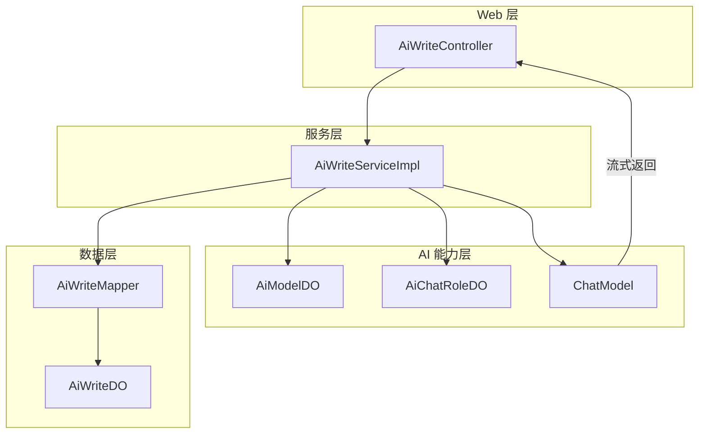
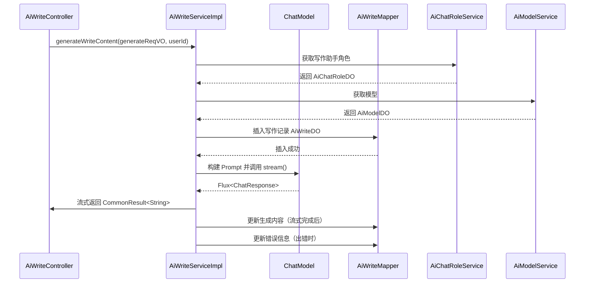
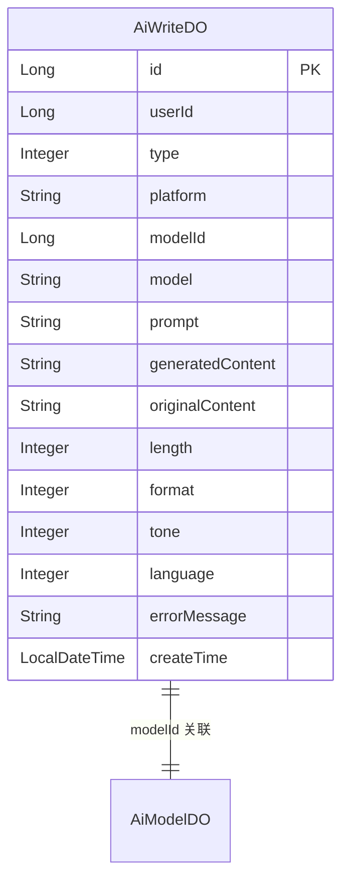

# AI 写作模块 (AI Write Module) 文档

## 1. 模块概述

AI 写作模块是 Yudao 框架中 AI 功能模块的重要组成部分，为用户提供基于大模型的智能写作服务。该模块支持流式内容生成、写作记录管理等功能，可应用于文案创作、内容回复等多种场景。

模块核心功能包括：
- **流式写作生成**：实时返回 AI 生成的内容，提升用户体验
- **写作记录管理**：支持分页查询、删除写作历史记录
- **多平台模型支持**：兼容 DashScope、讯飞星火、文心一言等多种 AI 平台
- **灵活的 Prompt 构建**：支持写作类型、语气、格式、语言、长度等参数配置

## 2. 架构设计

### 2.1 整体架构



### 2.2 组件关系

| 组件 | 职责 | 关联模块 |
|------|------|----------|
| `AiWriteController` | 提供 REST API 接口，处理 HTTP 请求 | 系统安全、Swagger |
| `AiWriteServiceImpl` | 业务逻辑实现，调用 AI 模型生成内容 | AI 配置、模型服务 |
| `AiWriteDO` | 数据对象，存储写作记录 | MyBatis、数据库 |
| `AiWriteGenerateReqVO` | 写作生成请求参数 | 校验框架 |
| `AiWritePageReqVO` | 分页查询请求参数 | 分页工具 |
| `AiWriteRespVO` | 响应数据对象 | BeanUtils |

## 3. 核心功能

### 3.1 流式写作生成

**接口路径**：`POST /ai/write/generate-stream`

**功能描述**：使用流式方式生成 AI 写作内容，实时返回生成的文本片段。

**请求参数** (`AiWriteGenerateReqVO`)：

| 字段 | 类型 | 必填 | 说明 | 示例 |
|------|------|------|------|------|
| type | Integer | 是 | 写作类型（1-撰写，2-回复） | 1 |
| prompt | String | 否 | 写作内容提示 | "撰写：田忌赛马" |
| originalContent | String | 否 | 原文（回复类型使用） | "领导我要辞职" |
| length | Integer | 是 | 长度（字典值） | 1 |
| format | Integer | 是 | 格式（字典值） | 1 |
| tone | Integer | 是 | 语气（字典值） | 1 |
| language | Integer | 是 | 语言（字典值） | 1 |

**处理流程**：



### 3.2 写作记录管理

#### 分页查询

**接口路径**：`GET /ai/write/page`

**请求参数** (`AiWritePageReqVO`)：

| 字段 | 类型 | 说明 |
|------|------|------|
| userId | Long | 用户编号 |
| type | Integer | 写作类型 |
| platform | String | 平台（如 TongYi） |
| createTime | LocalDateTime[] | 创建时间范围 |

#### 删除写作

**接口路径**：`DELETE /ai/write/delete`

**参数**：`id` - 写作编号

## 4. 数据模型

### 4.1 AiWriteDO 数据表结构



**字段说明**：

| 字段 | 类型 | 说明 |
|------|------|------|
| id | Long | 主键 |
| userId | Long | 用户编号（关联 AdminUserDO） |
| type | Integer | 写作类型（AiWriteTypeEnum） |
| platform | String | AI 平台（AiPlatformEnum） |
| modelId | Long | 模型编号（关联 AiModelDO） |
| model | String | 模型名称 |
| prompt | String | 生成内容提示 |
| generatedContent | String | 生成的内容 |
| originalContent | String | 原文 |
| length | Integer | 长度提示词（字典：ai_write_length） |
| format | Integer | 格式提示词（字典：ai_write_format） |
| tone | Integer | 语气提示词（字典：ai_write_tone） |
| language | Integer | 语言提示词（字典：ai_write_language） |
| errorMessage | String | 错误信息 |
| createTime | LocalDateTime | 创建时间 |

## 5. 配置说明

### 5.1 AI 配置 (`yudao.ai`)

AI 写作模块依赖全局 AI 配置，支持多平台接入。配置示例：

```yaml
yudao:
  ai:
    # 讯飞星火
    xinghuo:
      enable: true
      apiKey: your-api-key
      model: spark-light
      temperature: 0.7
      maxTokens: 8192
      topP: 0.9
    
    # 文心一言
    yiyan:
      enable: true
      apiKey: your-api-key
      model: ernie-bot-4
    
    # 通义千问（DashScope）
    dashscope:
      apiKey: your-api-key
    
    # 硅基流动
    siliconflow:
      enable: true
      apiKey: your-api-key
      model: deepseek-chat
```

### 5.2 字典配置

写作模块使用以下字典配置参数：

| 字典类型 | 说明 |
|----------|------|
| `ai_write_length` | 写作长度（短、中、长） |
| `ai_write_format` | 写作格式（段落、列表、JSON 等） |
| `ai_write_tone` | 写作语气（正式、轻松、专业等） |
| `ai_write_language` | 写作语言（中文、英文等） |

## 6. 依赖模块

AI 写作模块依赖以下核心模块：

| 模块 | 依赖说明 |
|------|----------|
| **AI 模块** (`yudao-module-ai`) | 模型服务、角色配置、AI 工具类 |
| **系统模块** (`yudao-module-system`) | 用户权限、租户上下文 |
| **MyBatis 模块** | 数据访问层 |
| **Spring Boot Starter** | 自动配置、Web 层 |
| **Redis 模块** | 缓存（部分 AI 相关） |

## 7. 错误处理

写作模块的错误处理机制：

1. **流式生成错误**：捕获异常后记录错误信息，返回 `WRITE_STREAM_ERROR` 错误码
2. **模型不存在**：抛出 `MODEL_NOT_EXISTS` 异常
3. **模型类型错误**：抛出 `MODEL_USE_TYPE_ERROR` 异常
4. **写作记录不存在**：删除操作时抛出 `WRITE_NOT_EXISTS` 异常

所有错误均通过 `CommonResult` 对象返回，前端可统一处理。

## 8. 安全控制

- **权限校验**：使用 `@PreAuthorize("@ss.hasPermission('ai:write:delete')")` 控制删除操作
- **身份获取**：通过 `SecurityFrameworkUtils.getLoginUserId()` 获取当前用户 ID
- **租户隔离**：使用 `TenantUtils.executeIgnore()` 在异步上下文中忽略租户隔离

## 9. 扩展点

### 9.1 支持的平台

通过 `AiAutoConfiguration` 可配置以下 AI 平台：

- DashScope（通义千问）
- 讯飞星火（XingHuo）
- 文心一言（YiYan）
- 硅基流动（SiliconFlow）
- 百川（BaiChuan）
- 智谱（ZhiPu）
- MiniMax
- 月之暗面（Moonshot）
- 阶跃星辰（StepFun）
- Grok

### 9.2 写作类型扩展

当前支持两种写作类型（`AiWriteTypeEnum`）：

- `WRITING`：撰写（根据提示词生成新内容）
- `REPLY`：回复（基于原文进行回复）

可通过扩展枚举和 `buildUserMessage()` 方法添加新类型。

## 10. 使用示例

### 10.1 生成写作内容（前端调用）

```javascript
// 使用 SSE 流式接收内容
const response = await fetch('/ai/write/generate-stream', {
  method: 'POST',
  headers: { 'Content-Type': 'application/json' },
  body: JSON.stringify({
    type: 1,
    prompt: '撰写：田忌赛马',
    length: 1,
    format: 1,
    tone: 1,
    language: 1
  })
});

const reader = response.body.getReader();
const decoder = new TextDecoder();
let content = '';

while (true) {
  const { done, value } = await reader.read();
  if (done) break;
  const chunk = decoder.decode(value);
  // 解析 CommonResult 格式，提取生成的文本内容
  content += chunk;
  // 实时更新 UI
}
```

### 10.2 查询写作记录

```javascript
// 分页查询写作记录
const response = await get('/ai/write/page', {
  params: {
    type: 1,
    platform: 'TongYi',
    createTime: ['2024-01-01 00:00:00', '2024-01-31 23:59:59']
  }
});
</file_text>