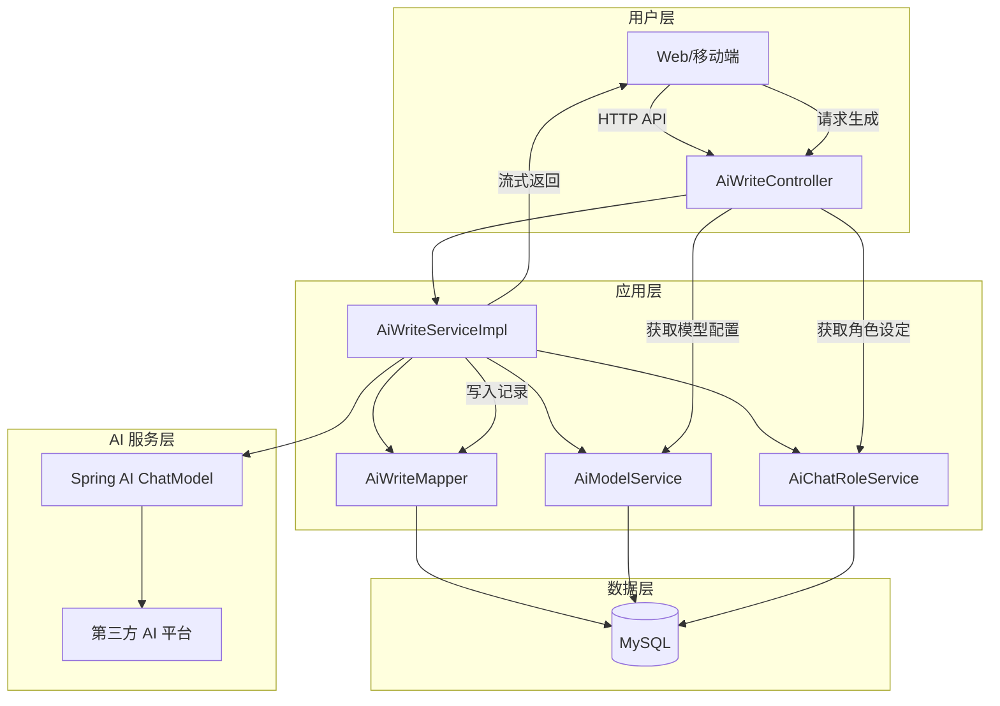
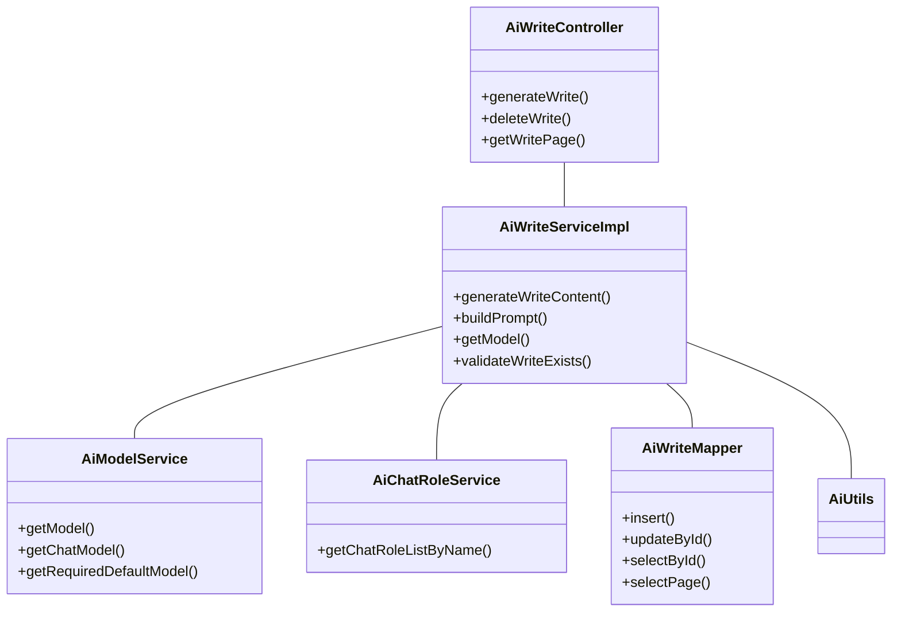

# AI 写作模块 (write_2) 文档

## 1. 模块概述

AI 写作模块是 Yudao 平台中基于人工智能技术的自动化内容生成子系统，为用户提供智能文本创作、文章续写、内容优化等功能。该模块集成了主流大语言模型能力，支持流式响应、多格式输出和灵活的 Prompt 构建，广泛应用于营销文案、技术文档、创意写作等场景。

## 2. 架构设计

### 2.1 系统架构图



### 2.2 组件关系图



## 3. 核心功能说明

### 3.1 智能写作生成 (`generateWriteContent`)

**功能描述**: 根据用户输入的参数，调用 AI 模型生成写作内容，支持流式返回。

**处理流程**:
1. **获取写作角色**: 从 `AiChatRole` 表中查找指定的写作助手角色（默认使用 `AI_WRITE_ROLE`）
2. **选择模型**: 
   - 如果角色指定了模型，则使用该模型
   - 否则使用默认的聊天模型（`AiModelTypeEnum.CHAT`）
3. **构建 Prompt**: 
   - 系统消息：来自角色的 `systemMessage` 或默认值
   - 用户消息：包含原始内容、格式、语气、语言、长度等参数
4. **调用模型**: 通过 `StreamingChatModel` 进行流式调用
5. **持久化记录**: 插入写作记录，更新生成的内容和错误信息

**参数说明**:
| 参数名 | 类型 | 必填 | 说明 |
|--------|------|------|------|
| prompt | String | 是 | 写作提示词 |
| type | AiWriteTypeEnum | 是 | 写作类型（WRITING/REPLY） |
| format | Integer | 否 | 输出格式（字典类型） |
| tone | Integer | 否 | 语气风格（字典类型） |
| language | Integer | 否 | 语言类型（字典类型） |
| length | Integer | 否 | 长度要求（字典类型） |
| originalContent | String | 否 | 原始内容（续写时使用） |

**返回值**: `Flux<CommonResult<String>>` - 流式返回生成的文本片段

### 3.2 删除写作记录 (`deleteWrite`)

**功能描述**: 删除指定的写作历史记录。

**处理流程**:
1. 校验记录是否存在
2. 执行删除操作

### 3.3 分页查询写作记录 (`getWritePage`)

**功能描述**: 查询写作记录列表，支持分页。

**处理流程**: 直接调用 Mapper 的分页查询方法，将 VO 转换为 DO 后返回。

## 4. 数据模型

### 4.1 AiWriteDO (写作数据对象)

```java
@Table(name = "ai_write")
public class AiWriteDO {
    @TableId(type = IdType.AUTO)
    private Long id;
    
    private Long userId;          // 用户ID
    private String platform;      // AI平台
    private String model;         // 模型名称
    private Long modelId;         // 模型ID
    private String systemMessage; // 系统消息
    private String prompt;        // 用户提示词
    private String format;        // 格式
    private String tone;          // 语气
    private String language;      // 语言
    private String length;        // 长度
    private String originalContent; // 原始内容
    private String generatedContent; // 生成内容
    private String errorMessage;  // 错误信息
    private LocalDateTime createTime;
}
```

### 4.2 AiWriteGenerateReqVO (生成请求VO)

```java
public class AiWriteGenerateReqVO {
    private String prompt;              // 提示词
    private Integer type;               // 写作类型
    private Integer format;             // 格式
    private Integer tone;               // 语气
    private Integer language;           // 语言
    private Integer length;             // 长度
    private String originalContent;     // 原始内容
}
```

### 4.3 AiWritePageReqVO (分页查询VO)

```java
public class AiWritePageReqVO extends PageReqVO {
    private String keyword;       // 关键词搜索
    private Integer modelId;      // 模型ID筛选
    private LocalDateTime beginCreateTime; // 开始时间
    private LocalDateTime endCreateTime;   // 结束时间
}
```

## 5. 依赖模块

AI 写作模块依赖于以下核心模块：

| 模块 | 依赖组件 | 用途 |
|------|----------|------|
| yudao-module-ai (model) | AiModelService, AiChatRoleService | 获取AI模型和角色配置 |
| yudao-framework-common | DictFrameworkUtils | 解析字典标签 |
| yudao-framework-tenant | TenantUtils | 租户上下文处理 |
| spring-ai | StreamingChatModel, ChatResponse | AI模型调用 |
| hutool | CollUtil, StrUtil, ObjUtil | 工具类辅助 |

## 6. 异常处理

模块定义了以下错误码：

| 错误码 | 说明 |
|--------|------|
| WRITE_NOT_EXISTS | 写作记录不存在 |
| MODEL_NOT_EXISTS | 模型不存在 |
| MODEL_USE_TYPE_ERROR | 模型类型不匹配 |
| WRITE_STREAM_ERROR | 写作流式调用失败 |

## 7. 使用示例

### 7.1 前端调用示例

```javascript
// 发起写作请求
const response = await aiWriteService.generateWrite({
    prompt: '写一篇关于人工智能的文章',
    type: 1, // 1=写作, 2=回复
    format: 1, // 格式选项
    tone: 1, // 语气选项
    language: 1, // 语言选项
    length: 1 // 长度选项
});

// 处理流式响应
response.subscribe(data => {
    if (data.isSuccess()) {
        appendToOutput(data.getData());
    }
});
```

### 7.2 后端代码示例

```java
// 调用生成方法
Flux<CommonResult<String>> result = aiWriteService.generateWriteContent(generateReqVO, userId);

// 订阅结果
result.subscribe(commonResult -> {
    if (commonResult.isSuccess()) {
        // 处理生成的文本片段
        log.info("Generated content: {}", commonResult.getData());
    } else {
        // 处理错误
        log.error("Generation failed: {}", commonResult.getMsg());
    }
});
```

## 8. 性能优化建议

1. **流式传输**: 使用 `Flux<ChatResponse>` 实现流式返回，减少首屏延迟
2. **异步持久化**: 使用 `TenantUtils.executeIgnore()` 在后台异步更新数据库，不影响主流程
3. **模型缓存**: 建议对常用模型和角色信息进行缓存，减少数据库查询
4. **连接池调优**: 根据AI平台的QPS限制合理配置连接池大小

## 9. 安全考虑

1. **权限控制**: 所有接口需验证用户身份和权限
2. **输入过滤**: 对用户输入的 Prompt 内容进行敏感词过滤
3. **速率限制**: 防止恶意调用导致资源耗尽
4. **数据脱敏**: 生成的内容中可能包含敏感信息，需注意脱敏处理

## 10. 扩展性设计

1. **多平台支持**: 通过 `AiPlatformEnum` 支持多个AI平台接入
2. **多模型支持**: 可配置不同的模型用于不同场景
3. **角色定制**: 通过 `AiChatRoleDO` 灵活定义不同角色的系统消息和行为
4. **字典驱动**: 格式、语气、语言、长度等参数使用字典配置，便于扩展

## 11. 相关接口文档

- [AI 对话模块](chat.md) - 对话管理相关功能
- [AI 模型管理](model.md) - AI模型配置和管理
- [AI 知识库](knowledge.md) - 知识文档管理
- [系统基础模块](system.md) - 用户、权限、租户等基础服务
