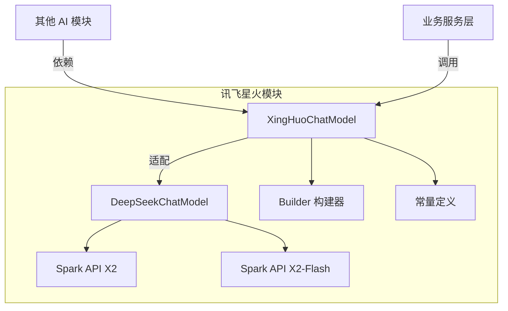
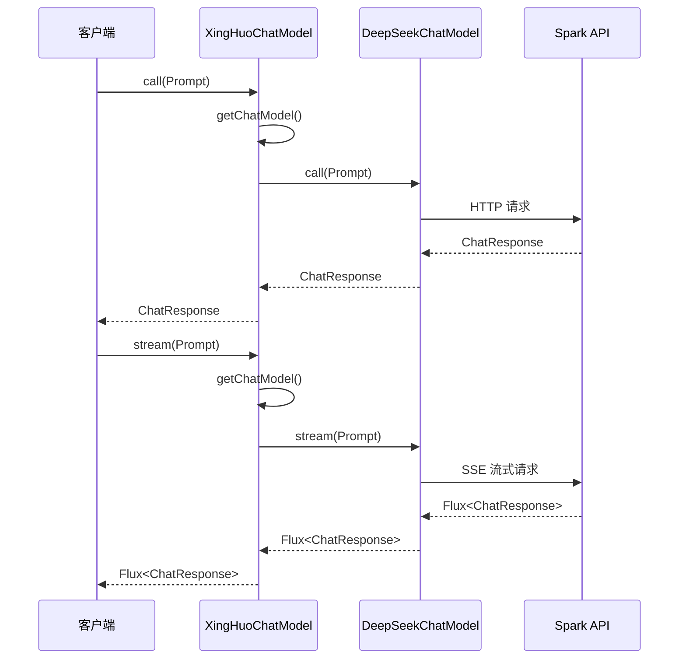
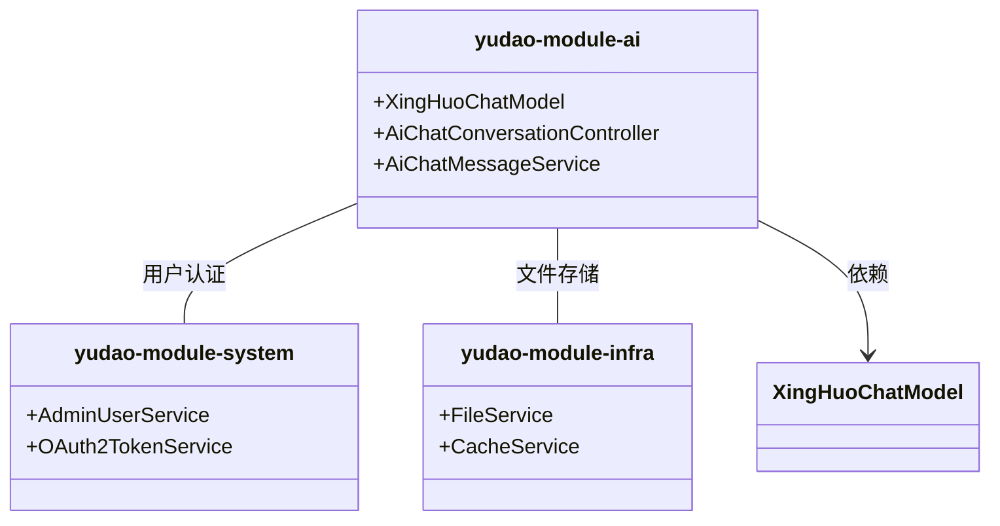

# 讯飞星火 (XingHuo) AI 模块文档

## 1. 概述

讯飞星火模块是 Yudao 框架中集成科大讯飞星火大语言模型的核心组件，提供了对星火 X2 和 X2 Flash 模型的统一访问接口。该模块基于 Spring AI 框架实现，通过 DeepSeekChatModel 适配器兼容 OpenAI 风格的 API，支持同步调用和流式响应两种交互模式。

## 2. 架构设计

### 2.1 模块定位



### 2.2 核心组件关系

- **XingHuoChatModel**: 核心实现类，提供 ChatModel 接口
- **DeepSeekChatModel**: 底层适配层，负责与 Spark API 通信
- **Builder**: 构建器模式，用于灵活配置模型参数
- **常量类**: 定义模型类型、Base URL 等固定值

## 3. 核心功能

### 3.1 模型支持

| 模型名称 | 标识符 | Base URL | 说明 |
|---------|--------|----------|------|
| 星火 X2 | `x2` | `https://spark-api-open.xf-yun.com/x2` | 标准版本 |
| 星火 X2 Flash | `x2-flash` | `https://spark-api-open.xf-yun.com/agent/v1` | 快速版本（默认） |

### 3.2 主要方法



## 4. 代码详解

### 4.1 XingHuoChatModel 类

```java
package cn.iocoder.yudao.module.ai.framework.ai.core.model.xinghuo;

import cn.hutool.core.util.StrUtil;
import lombok.extern.slf4j.Slf4j;
import org.springframework.ai.chat.model.ChatModel;
import org.springframework.ai.chat.model.ChatResponse;
import org.springframework.ai.chat.prompt.ChatOptions;
import org.springframework.ai.chat.prompt.Prompt;
import org.springframework.ai.deepseek.DeepSeekChatModel;
import org.springframework.ai.deepseek.DeepSeekChatOptions;
import org.springframework.ai.deepseek.api.DeepSeekApi;
import reactor.core.publisher.Flux;

/**
 * 讯飞星火 {@link ChatModel} 实现类
 *
 * @author fansili
 */
@Slf4j
public class XingHuoChatModel implements ChatModel {

    /**
     * 星火 X2
     *
     * @see <a href="https://spark-api-open.xf-yun.com/x2/chat/completions">接口地址</a>
     */
    public static final String MODEL_X2 = "x2";

    /**
     * 星火 X2 Flash
     *
     * @see <a href="https://spark-api-open.xf-yun.com/agent/v1/chat/completions">接口地址</a>
     */
    public static final String MODEL_X2_FLASH = "x2-flash";

    private static final String BASE_URL_X2 = "https://spark-api-open.xf-yun.com/x2";

    private static final String BASE_URL_X2_FLASH = "https://spark-api-open.xf-yun.com/agent/v1";

    public static final String MODEL_DEFAULT = MODEL_X2_FLASH;

    private final String apiKey;

    private final DeepSeekChatOptions options;

    /**
     * 兼容 OpenAI 接口，进行复用
     */
    private final ChatModel chatModelX2;

    private final ChatModel chatModelX2Flash;

    private XingHuoChatModel(String apiKey, DeepSeekChatOptions options) {
        this.apiKey = apiKey;
        this.options = options;
        this.chatModelX2 = buildChatModel(MODEL_X2);
        this.chatModelX2Flash = buildChatModel(MODEL_X2_FLASH);
    }

    // 省略其他方法...
}
```

#### 关键特性：

1. **双模型支持**：同时维护两个 DeepSeekChatModel 实例，分别对应 X2 和 X2-Flash
2. **动态路由**：根据 Prompt 中的 ChatOptions 自动选择合适模型
3. **流式支持**：通过 `Flux<ChatResponse>` 实现流式响应
4. **构建器模式**：提供 Builder 简化对象创建

### 4.2 构建器模式

```java
public static final class Builder {

    private String apiKey;

    private DeepSeekChatOptions options;

    public Builder apiKey(String apiKey) {
        this.apiKey = apiKey;
        return this;
    }

    public Builder options(DeepSeekChatOptions options) {
        this.options = options;
        return this;
    }

    public XingHuoChatModel build() {
        DeepSeekChatOptions options = this.options != null ? this.options : DeepSeekChatOptions.builder().build();
        if (StrUtil.isEmpty(options.getModel())) {
            options = options.mutate().model(MODEL_DEFAULT).build();
        }
        return new XingHuoChatModel(apiKey, options);
    }

}
```

使用示例：
```java
XingHuoChatModel model = XingHuoChatModel.builder()
    .apiKey("your-api-key")
    .options(DeepSeekChatOptions.builder()
        .model(XingHuoChatModel.MODEL_X2_FLASH)
        .temperature(0.7f)
        .build())
    .build();
```

### 4.3 模型选择逻辑

```java
private ChatModel getChatModel(Prompt prompt) {
    String model = options.getModel();
    ChatOptions options = prompt.getOptions();
    if (options != null && isBusinessModel(options.getModel())) {
        model = options.getModel();
    }
    return getChatModel(model);
}

private ChatModel getChatModel(String model) {
    if (MODEL_X2_FLASH.equals(model)) {
        return chatModelX2Flash;
    }
    return chatModelX2;
}

private static boolean isBusinessModel(String model) {
    return MODEL_X2.equals(model) || MODEL_X2_FLASH.equals(model);
}
```

优先级：Prompt 中的选项 > 全局默认选项

## 5. 集成方式

### 5.1 Maven 依赖

```xml
<dependency>
    <groupId>cn.iocoder</groupId>
    <artifactId>yudao-module-ai</artifactId>
    <version>${yudao.version}</version>
</dependency>
```

### 5.2 配置示例

```yaml
# application.yml
yunai:
  ai:
    xinghuo:
      api-key: ${XINGHUO_API_KEY}
      model: x2-flash # 或 x2
      temperature: 0.7
      top_p: 0.9
```

### 5.3 Service 层注入

```java
@Service
public class AiChatService {

    @Autowired
    private XingHuoChatModel xingHuoChatModel;

    public String generateAnswer(String question) {
        List<ChatMessage> messages = new ArrayList<>();
        messages.add(new UserMessage(question));
        
        Prompt prompt = new Prompt(messages);
        ChatResponse response = xingHuoChatModel.call(prompt);
        
        return response.getResults().get(0).getOutput().getContent();
    }
}
```

## 6. 错误处理

虽然当前代码未显示详细的异常处理，但建议在实际使用中添加：

```java
try {
    ChatResponse response = xingHuoChatModel.call(prompt);
} catch (Exception e) {
    log.error("讯飞星火调用失败", e);
    // 返回友好提示或降级策略
}
```

## 7. 性能优化建议

1. **单例模式**：XingHuoChatModel 应作为单例 Bean 管理，避免重复创建
2. **连接池配置**：调整 DeepSeekChatModel 的 HTTP 连接池参数
3. **缓存机制**：对频繁使用的 Prompt 结果进行缓存
4. **异步处理**：对于非实时性要求高的任务，使用异步调用

## 8. 与其他模块的关系



## 9. 常见问题

### Q1: 如何选择 X2 还是 X2-Flash？
- **X2**：能力更强，适合复杂任务，响应稍慢
- **X2-Flash**：响应更快，适合简单对话，默认推荐

### Q2: 如何设置温度（temperature）？
通过 DeepSeekChatOptions 配置：
```java
DeepSeekChatOptions options = DeepSeekChatOptions.builder()
    .temperature(0.7f)
    .build();
```

### Q3: 如何实现流式响应？
使用 `stream()` 方法配合 Reactor 的 Flux：
```java
Flux<ChatResponse> stream = xingHuoChatModel.stream(prompt);
stream.subscribe(response -> {
    // 逐条处理响应内容
});
```

## 10. 参考文档

- [讯飞星火开放平台](https://spark-api-open.xf-yun.com/)
- [Spring AI 官方文档](https://spring.io/projects/spring-ai)
- [DeepSeek API 文档](https://deepseek.com/api)

---

*文档生成日期：2024年*  
*最后更新：2024年*